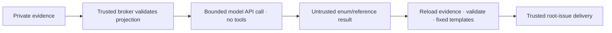

# Deployment investigation: evidence reader and publication review

SHA-201 begins with two trusted security components. They are library code for
review, not an activated worker route. Diagnostics remain off on live targets.
The legacy `ready-for-investigation` worker is refused for deployment roots by
the routing fence described below; no raw bundle may be handed to it. No model process, broker endpoint, investigator-findings
sender, target enablement or production repair is installed by this change.

## Trusted evidence reader

`factory.investigation_evidence.read_evidence(factory, incident_id, run_id)`
resolves the local incident's exact run, reads committed modern deployment rows
under a nonblocking shared journal lock, and requires an unresolved terminal
failure. Compatibility notifications never supply authority. It then verifies
manifest identity, the unique diagnostics entry's size/hash, bundle identity,
known namespace/region/version and failure-window provenance. Allocation details
must refer to a matching version and a lifetime intersecting the window, with
an earlier authenticated allocation-list reference. Current job state remains
separate from recorded-health-version evidence. Evaluations correlate by job
and time and do not assert a deployed version.

Every ancestor and leaf is opened using descriptor-relative `O_NOFOLLOW` reads;
symlinks, nonregular files, traversal, conflicting identities, unauthenticated
artifacts, unknown windows or partial evidence fail closed with fixed
reason codes. The store root must be a real canonical path supplied by trusted
configuration, not a worker path. Duplicate JSON keys are rejected in incident,
manifest and bundle objects. Reads do not create files or make network calls.
Limits: 1 MiB per artifact/incident/manifest and per journal line; each journal
file has the configured `journal_max_mb` rotation threshold plus one bounded row
of rotation overshoot. Retained segment count follows configured journal retention.
Read the live file first; only open newest-to-oldest archives when the run is not
there. Filter unrelated run/ticket bytes before JSON parsing, retain at most 4096
relevant replay rows and use a five-second journal deadline. Replay relevant rows
chronologically through the same `deploy.replay_rows` resolution rule as incident
sync: a later successful ticket run, acknowledgement or supersession refuses the
old failure. Historical failure/version evidence does not expire after one hour;
only current-job observations older than an hour become `status=stale`, without
current values. Collection/window provenance remains strict. Limits also include
256 projected rows and a 128 KiB serialized projection. Incomplete evidence needs
human handling, not a widened model request. Local file/JSON processing overhead is not a hard process deadline.

The broker returns immutable serialized projection bytes plus trusted private
routing metadata. Only `Projection.payload` crosses the model boundary. Job,
namespace, target, run, allocation, evaluation and task identifiers are hashed
aliases; public evidence references are generated `e0001` values. Only known
states, event types, bounded numeric placement/resource metrics, exit codes and
normalized timestamps enter the projection. No logs, messages, error text,
status descriptions, constraint/group/task names, Consul Output, host paths,
plans or original source identifiers enter it. Unrecognized states become `unknown` and event strings become
`Other`; a numeric exit code 137 alone cannot support an OOM finding.

This is data minimization, not cryptographic attestation of the filesystem or
proof that Nomad's observations establish causality. The trusted broker must own
the source store; a worker must not be able to alter either the source or broker.

## Fixed-template public publisher

`factory.investigation_publication.render_for_incident(...)` reloads original
evidence at publication time and validates a bounded JSON result against the
fresh projection hash. A worker may return only an enumerated outcome, finding
codes, evidence references and action code. Unknown fields, duplicate keys,
free-form prose, destination changes, unsupported claims and stale hashes are
refused. Escalations also use fixed reason codes and templates.

A placement/resource finding requires a blocked/failed evaluation and its
supporting numeric counter. OOM requires a Terminated task event with an explicit
normalized OOMKilled=true on recorded version lineage. The collector accepts
only Details["oom_killed"] equal to the literal "true" or "false" and emits a
boolean; it never retains the arbitrary Details map. Templates describe observed symptoms and review steps,
including uncertainty, validation, risks and rollback. They never assert that an
exit code establishes a cause, nor generate concrete edits or file scope. The
later investigation logic must validate repository scope before a fix proposal.

`prepare_for_incident(...)` prepares an immutable envelope for a future trusted
outbox sender. The destination is the locally recorded root issue, checked
against the configured repository, not the original failed ticket or a
worker-selected endpoint. An incident still pending delivery or marked uncertain
is not a publication destination, even when its issue number is populated. It carries a stable projection-based idempotency key.
It does not post. The future sender must persist/deduplicate delivery, validate
root routing and use its own role; the worker receives no GitHub credential.
Result limit is 8 KiB; rendered public output is at most 16 KiB. Neither a worker
payload nor a serialized worker-provided projection is publication authority.

Example worker result for insufficient evidence:

```json
{"projection_sha256":"<trusted projection hash>","outcome":"escalate","reason":"INSUFFICIENT"}
```

## Model execution decision: trusted API call, no agent CLI

For SHA-201's first cut, the trusted broker calls an operator-configured model
API with the authenticated projection and fixed instructions. The model has no
tools, credentials for Factory/GitHub/Nomad/Consul, host files, forwarded socket,
repository checkout or generated-code execution. The API client owns only the
model endpoint credential; it must not reuse a general agent command or silently
inherit the triage transport. Endpoint/auth settings belong to the operator,
never to the incident, model response or diagnostic payload.



Before the call, persist its incident/run/projection hash and finite request,
time, input and response budgets. Enforce HTTP and response limits as well as
provider output limits. Treat unknown outcomes as durable uncertainty, without
blind retries. No free-text response, tool call, endpoint override or invented
reference can trigger code, diagnostics, publication, merge or apply. Reject
invalid responses and use the fixed human-escalation path. Public delivery has
its own durable receipt and identity; returning model JSON is not authority.
These transport/budget/outbox components remain unimplemented and unactivated.

The first cut does **not** invoke `investigation_isolation.run`. That primitive
is retained for a separately reviewed future deterministic/code-tool use. It
must remain credentialless and offline; adding an agent CLI or model-forwarding
socket would require a new boundary review. Namespace/cgroup tests protect the
primitive, but they are not proof that a complete investigator is accepted.

## Review gates before investigation logic and enablement

Review these two modules and adversarial fixtures first. Remaining SHA-201 work:
incident routing, OS/process isolation from same-user private files and direct
Nomad/Consul/network/GitHub access, durable request/time/output budgets, private
result/proposal persistence, trusted delivery, concrete repository-scoped
proposals and controlled acceptance. A prompt rule, file mode or stripped token
is not isolation. Nomad ACLs are currently disabled; anonymous network access
must be fenced independently. ACL rollout remains deferred to SHA-113 planning.

First-cut supported classes are placement constraints, resource exhaustion and
explicit OOM, when structured evidence is sufficient. Configuration, dependency,
generic startup/health and ambiguous cases escalate. Supported templates do not
remove the requirement to assess contradictory evidence and competing causes.

Only after the isolated route is installed and accepted may an operator review
structured-only target diagnostics (`logs=false`). Logs-enabled collection and
log-assisted publication require a separate explicit secret-review gate outside
this first cut; paraphrasing does not make unknown workload secrets safe.
Phase order stays 1 → 2 → 4 → 3 → 5. PR #3's accepted follow-up can ship with the
first SHA-201 runtime release. No merge/apply authority comes from findings.

API shape checked against Nomad 2.0.4: [allocation metrics](https://github.com/hashicorp/nomad/blob/v2.0.4/api/allocations.go) expose NodesAvailable as a datacenter map, and [task event OOM signal](https://github.com/hashicorp/nomad/blob/v2.0.4/nomad/structs/structs.go) is set in Details["oom_killed"]. Datacenter names are omitted and counts summed; arbitrary event Details stay excluded.

## Evidence refusal and legacy route fencing

`render_refusal(incident_id, refusal_code)` emits a fixed human-escalation template
without reading a projection, journal or bundle. Only validated incident IDs and
allowlisted fixed reader codes are accepted; exception messages and model prose
are never rendered. `prepare_refusal(...)` resolves only trusted local incident
metadata and requires a delivered, unambiguous root issue in the configured repo.
If the incident routing itself is missing/unsafe, posting is refused; the future
outbox must preserve an operator-visible local failure. No posting transport is
installed by these functions.

Deployment roots are refused before legacy worker admission, including forced
execution or a changed label. Both frontier and freshly queried issue bodies
are checked for the incident marker; local incident issue mappings independently
block marker removal. A private incident store does not disable unrelated software investigations,
including findings already in flight. The free-form findings publisher independently
checks fresh routing and refuses before reading its handoff. Confirmed deployment
incidents instead receive a fixed human handoff.
Unsafe/unavailable routing fails closed. Unrelated software tickets
remain schedulable. This is a routing fence, not process/file/network isolation:
an isolated replacement investigator and its trusted delivery remain outstanding.
Keep diagnostics disabled until that replacement is installed and accepted.

Nomad 2.0.4 [deployment states](https://github.com/hashicorp/nomad/blob/v2.0.4/nomad/structs/deployment.go)
include pending, initializing and unblocking; these are allowlisted. Unknown state
strings remain minimized, never reflected publicly and never prove a diagnosis.

### Temporary human handoff until the isolated investigator is accepted

A refused deployment root receives one fixed comment and an idempotent label
change: remove ready-for-investigation/ready-for-agent, add ready-for-human,
retain unrelated labels. No legacy findings are read or included. A per-issue
lock and durable routing-handoffs receipt prevent concurrent/restarted duplicate
comment creation and repeated journal refusal events. REST comment-marker lookup
can adopt a prior comment after a crash; search-index lag is not used. Persist
uncertain intent before POST. An unknown create outcome is never automatically
repeated; still route to ready-for-human and retain comment=uncertain in the local
receipt for operator reconciliation. Exactly-once remote creation cannot be
promised under an uncertain response. A failed label edit is retried with the
existing confirmed/uncertain comment state, without posting again. Once the
handoff completes, repeated stale/forced dispatch calls do not write another
refusal event. Missing/unsafe identity lookup remains a local safe refusal,
without publishing arbitrary findings to an unconfirmed incident destination.
Implementation and tests make no live incident comment/label writes or diagnostic enablement.

New and reopened SHA-199 deployment incidents are also labelled ready-for-human
until the isolated investigator is accepted. Repeated failure delivery therefore
does not put a handed-off root back into the legacy lane. The incident body
explicitly states this temporary handoff policy.

## Routing observability and retained incident identities

`factory inspect` includes incident_routing: current scan health/count, explicit
not_pruned retention, last repository-wide availability transition/audit state,
and per-issue handoff comment state. `factory doctor` fails for unavailable
routing/receipt observation and warns on uncertain/failed comments or an
uncertain journal audit attempt. Metadata uses fixed codes, statuses, validated
IDs/timestamps and HTTP status codes only; raw error text/paths are omitted.

Dispatch records incident-routing-unavailable once per outage and
incident-routing-recovered once when a non-incident identity scan succeeds.
A durable repository receipt deduplicates transitions across tickets/passes and
restart. Persist intent before the journal attempt; an interrupted attempt is
reported as audit=uncertain and is not blindly repeated. This receipt remains
observable even when the journal write fails. Repair/reconcile the invalid store
or scan constraint, then let the next successful dispatch scan record recovery.

Incident JSON records are not pruned: they retain outbox/deduplication and root
identity history. The old 256-record hard cap is removed. Directory enumeration
is streamed under the existing two-second scan budget; a 301-record regression
stays routable. Larger stores can still exhaust the time budget, now reported
explicitly rather than producing a silent stop. A scalable durable issue index
or reviewed archival policy remains follow-up work; do not delete incident
records casually to restore scheduling.

Handoff journal records include comment_state. Definite HTTP request rejections
are reported as failed/HTTPxxx, distinct from uncertain transport outcomes;
humans are still notified by labels, and neither state is automatically reposted.
A completed handoff's existing fixed comment explains a later manual attempt to
relabel it for the legacy investigator. Another comment on every relabel/pass
is intentionally avoided. Comment-author binding remains a follow-up alongside
the dedicated publisher identity; current marker adoption is a deduplication
hint, never permission to run a worker or deploy. Labels use config.LABEL_*.

### Unactivated OS boundary

`investigation_isolation.run` is a Linux-only, fail-closed primitive, not an
active investigator. It runs trusted worker code with projection bytes on stdin
in strict user, PID, network, IPC and UTS namespaces. Root is read-only; only
system binaries/libraries, a private proc/dev and a bounded temporary filesystem
are mounted. Home, repository, Factory store, host sockets and configuration are
absent. Environment and inherited descriptors are cleared. Sealed anonymous
files carry input/code; wall time, address space, CPU, file size, descriptor count
and combined output have limits. Raw returned bytes still require the trusted
publisher's validation. No credential or network delegation is implemented.

A transient `systemd-run --user --scope` contains the launcher and every
worker descendant: TasksMax=32, MemoryMax=256 MiB, MemorySwapMax=0,
CPUQuota=100% and RuntimeMaxSec bounded by the requested wall time (at most 30s).
The trusted bootstrap checks actual cgroup-v2 pids/memory/swap/CPU limits and
scope identity before executing bubblewrap; missing/unlimited controllers refuse
the run. Cleanup stops only the generated scope. Per-process prlimit is retained
as an additional limit, not aggregate protection. No Factory service property,
host policy or production runtime is changed by this library.

CI installs bubblewrap, prepares an ephemeral user manager and enables user
namespaces on the disposable runner. FACTORY_REQUIRE_ISOLATION=1 turns absent
prerequisites into test failures. Real fixtures test private file/environment/
network boundaries, timeout/output limits, finite forks and a memory allocation
above memory.max, then a clean follow-up run. Ordinary macOS/container suite
runs can skip these three Linux-only tests and are not sandbox evidence.
`scripts/test-linux.sh` does not prepare systemd/cgroup delegation; the required
host CI and scoped Barlow fixtures provide this acceptance layer instead.

This shares the host kernel and is not a VM. A reviewed syscall policy and
accepted future code-tool integration remain gates before activating this
primitive. The no-tools first-cut model route does not activate it. There is no
fallback when bubblewrap, the user manager or kernel controllers are unavailable.
See [systemd scope execution](https://github.com/systemd/systemd/blob/main/man/systemd-run.xml)
and [aggregate resource controls](https://github.com/systemd/systemd/blob/main/man/systemd.resource-control.xml).
See [bubblewrap's upstream manual](https://github.com/containers/bubblewrap/blob/main/bwrap.xml).

`last_transition` is dispatch audit history, not a current health verdict. A
repaired outage can remain the latest transition until a successful non-incident
admission scan records recovery; doctor/inspect's current scan is authoritative.
Concurrent availability writers use a nonblocking lock and can log harmless
audit contention without duplicating transition records.
