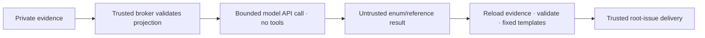

# Deployment investigation: evidence reader and publication review

SHA-201 begins with two trusted security components. They are library code for
review, not an activated worker route. Diagnostics remain off on live targets.
The legacy `ready-for-investigation` worker is refused for deployment roots by
the routing fence described below; no raw bundle may be handed to it. No model process, broker endpoint, investigator-findings
sender, target enablement or production repair is installed by this change.

## Trusted evidence reader

`factory.investigation_evidence.read_evidence(factory, incident_id, run_id)`
resolves the local incident's exact run, reads committed modern deployment rows
under a nonblocking shared journal lock, and requires an unresolved terminal
failure. Compatibility notifications never supply authority. It then verifies
manifest identity, the unique diagnostics entry's size/hash, bundle identity,
known namespace/region/version and failure-window provenance. Allocation details
must refer to a matching version and a lifetime intersecting the window, with
an earlier authenticated allocation-list reference. Current job state remains
separate from recorded-health-version evidence. Evaluations correlate by job
and time and do not assert a deployed version.

Every ancestor and leaf is opened using descriptor-relative `O_NOFOLLOW` reads;
symlinks, nonregular files, traversal, conflicting identities, unauthenticated
artifacts, unknown windows or partial evidence fail closed with fixed
reason codes. The store root must be a real canonical path supplied by trusted
configuration, not a worker path. Duplicate JSON keys are rejected in incident,
manifest and bundle objects. Reads do not create files or make network calls.
Limits: 1 MiB per artifact/incident/manifest and per journal line; each journal
file has the configured `journal_max_mb` rotation threshold plus one bounded row
of rotation overshoot. Retained segment count follows configured journal retention.
Read the live file first; only open newest-to-oldest archives when the run is not
there. Filter unrelated run/ticket bytes before JSON parsing, retain at most 4096
relevant replay rows and use a five-second journal deadline. Replay relevant rows
chronologically through the same `deploy.replay_rows` resolution rule as incident
sync: a later successful ticket run, acknowledgement or supersession refuses the
old failure. Historical failure/version evidence does not expire after one hour;
only current-job observations older than an hour become `status=stale`, without
current values. Collection/window provenance remains strict. Limits also include
256 projected rows and a 128 KiB serialized projection. Incomplete evidence needs
human handling, not a widened model request. Local file/JSON processing overhead is not a hard process deadline.

The broker returns immutable serialized projection bytes plus trusted private
routing metadata. Only `Projection.payload` crosses the model boundary. Job,
namespace, target, run, allocation, evaluation and task identifiers are hashed
aliases; public evidence references are generated `e0001` values. Only known
states, event types, bounded numeric placement/resource metrics, exit codes and
normalized timestamps enter the projection. No logs, messages, error text,
status descriptions, constraint/group/task names, Consul Output, host paths,
plans or original source identifiers enter it. Unrecognized states become `unknown` and event strings become
`Other`; a numeric exit code 137 alone cannot support an OOM finding.

This is data minimization, not cryptographic attestation of the filesystem or
proof that Nomad's observations establish causality. The trusted broker must own
the source store; a worker must not be able to alter either the source or broker.

## Fixed-template public publisher

`factory.investigation_publication.render_for_incident(...)` reloads original
evidence at publication time and validates a bounded JSON result against the
fresh projection hash. A worker may return only an enumerated outcome, finding
codes, evidence references and action code. Unknown fields, duplicate keys,
free-form prose, destination changes, unsupported claims and stale hashes are
refused. Escalations also use fixed reason codes and templates.

A placement/resource finding requires a blocked/failed evaluation and its
supporting numeric counter. OOM requires a Terminated task event with an explicit
normalized OOMKilled=true on recorded version lineage. The collector accepts
only Details["oom_killed"] equal to the literal "true" or "false" and emits a
boolean; it never retains the arbitrary Details map. Templates describe observed symptoms and review steps,
including uncertainty, validation, risks and rollback. They never assert that an
exit code establishes a cause, nor generate concrete edits or file scope. The
later investigation logic must validate repository scope before a fix proposal.

`prepare_for_incident(...)` prepares an immutable envelope for a future trusted
outbox sender. The destination is the locally recorded root issue, checked
against the configured repository, not the original failed ticket or a
worker-selected endpoint. An incident still pending delivery or marked uncertain
is not a publication destination, even when its issue number is populated. It carries a stable projection-based idempotency key.
It does not post. The future sender must persist/deduplicate delivery, validate
root routing and use its own role; the worker receives no GitHub credential.
Result limit is 8 KiB; rendered public output is at most 16 KiB. Neither a worker
payload nor a serialized worker-provided projection is publication authority.

Example worker result for insufficient evidence:

```json
{"projection_sha256":"<trusted projection hash>","outcome":"escalate","reason":"INSUFFICIENT"}
```

## Model execution decision: trusted API call, no agent CLI

For SHA-201's first cut, the trusted broker calls an operator-configured model
API with the authenticated projection and fixed instructions. The model has no
tools, credentials for Factory/GitHub/Nomad/Consul, host files, forwarded socket,
repository checkout or generated-code execution. The API client owns only the
model endpoint credential; it must not reuse a general agent command or silently
inherit the triage transport. Endpoint/auth settings belong to the operator,
never to the incident, model response or diagnostic payload.



Before the call, persist its incident/run/projection hash and finite request,
time, input and response budgets. Enforce HTTP and response limits as well as
provider output limits. Treat unknown outcomes as durable uncertainty, without
blind retries. No free-text response, tool call, endpoint override or invented
reference can trigger code, diagnostics, publication, merge or apply. Reject
invalid responses and use the fixed human-escalation path. Public delivery has
its own durable receipt and identity; returning model JSON is not authority.
The transport and private budget/result receipts are implemented below; trusted
public outbox/delivery and route activation remain unimplemented.

The first cut does **not** invoke `investigation_isolation.run`. That primitive
is retained for a separately reviewed future deterministic/code-tool use. It
must remain credentialless and offline; adding an agent CLI or model-forwarding
socket would require a new boundary review. Namespace/cgroup tests protect the
primitive, but they are not proof that a complete investigator is accepted.

## Review gates before investigation logic and enablement

Review these two modules and adversarial fixtures first. Remaining SHA-201 work:
incident routing, OS/process isolation from same-user private files and direct
Nomad/Consul/network/GitHub access, durable request/time/output budgets, private
result/proposal persistence, trusted delivery, concrete repository-scoped
proposals and controlled acceptance. A prompt rule, file mode or stripped token
is not isolation. Nomad ACLs are currently disabled; anonymous network access
must be fenced independently. ACL rollout remains deferred to SHA-113 planning.

First-cut supported classes are placement constraints, resource exhaustion and
explicit OOM, when structured evidence is sufficient. Configuration, dependency,
generic startup/health and ambiguous cases escalate. Supported templates do not
remove the requirement to assess contradictory evidence and competing causes.

Only after the isolated route is installed and accepted may an operator review
structured-only target diagnostics (`logs=false`). Logs-enabled collection and
log-assisted publication require a separate explicit secret-review gate outside
this first cut; paraphrasing does not make unknown workload secrets safe.
Phase order stays 1 → 2 → 4 → 3 → 5. PR #3's accepted follow-up can ship with the
first SHA-201 runtime release. No merge/apply authority comes from findings.

API shape checked against Nomad 2.0.4: [allocation metrics](https://github.com/hashicorp/nomad/blob/v2.0.4/api/allocations.go) expose NodesAvailable as a datacenter map, and [task event OOM signal](https://github.com/hashicorp/nomad/blob/v2.0.4/nomad/structs/structs.go) is set in Details["oom_killed"]. Datacenter names are omitted and counts summed; arbitrary event Details stay excluded.

## Evidence refusal and legacy route fencing

`render_refusal(incident_id, refusal_code)` emits a fixed human-escalation template
without reading a projection, journal or bundle. Only validated incident IDs and
allowlisted fixed reader codes are accepted; exception messages and model prose
are never rendered. `prepare_refusal(...)` resolves only trusted local incident
metadata and requires a delivered, unambiguous root issue in the configured repo.
If the incident routing itself is missing/unsafe, posting is refused; the future
outbox must preserve an operator-visible local failure. No posting transport is
installed by these functions.

Deployment roots are refused before legacy worker admission, including forced
execution or a changed label. Both frontier and freshly queried issue bodies
are checked for the incident marker; local incident issue mappings independently
block marker removal. A private incident store does not disable unrelated software investigations,
including findings already in flight. The free-form findings publisher independently
checks fresh routing and refuses before reading its handoff. Confirmed deployment
incidents instead receive a fixed human handoff.
Unsafe/unavailable routing fails closed. Unrelated software tickets
remain schedulable. This is a routing fence, not process/file/network isolation:
an isolated replacement investigator and its trusted delivery remain outstanding.
Keep diagnostics disabled until that replacement is installed and accepted.

Nomad 2.0.4 [deployment states](https://github.com/hashicorp/nomad/blob/v2.0.4/nomad/structs/deployment.go)
include pending, initializing and unblocking; these are allowlisted. Unknown state
strings remain minimized, never reflected publicly and never prove a diagnosis.

### Temporary human handoff until the isolated investigator is accepted

A refused deployment root receives one fixed comment and an idempotent label
change: remove ready-for-investigation/ready-for-agent, add ready-for-human,
retain unrelated labels. No legacy findings are read or included. A per-issue
lock and durable routing-handoffs receipt prevent concurrent/restarted duplicate
comment creation and repeated journal refusal events. REST comment-marker lookup
can adopt a prior comment after a crash; search-index lag is not used. Persist
uncertain intent before POST. An unknown create outcome is never automatically
repeated; still route to ready-for-human and retain comment=uncertain in the local
receipt for operator reconciliation. Exactly-once remote creation cannot be
promised under an uncertain response. A failed label edit is retried with the
existing confirmed/uncertain comment state, without posting again. Once the
handoff completes, repeated stale/forced dispatch calls do not write another
refusal event. Missing/unsafe identity lookup remains a local safe refusal,
without publishing arbitrary findings to an unconfirmed incident destination.
Implementation and tests make no live incident comment/label writes or diagnostic enablement.

New and reopened SHA-199 deployment incidents are also labelled ready-for-human
until the isolated investigator is accepted. Repeated failure delivery therefore
does not put a handed-off root back into the legacy lane. The incident body
explicitly states this temporary handoff policy.

## Routing observability and retained incident identities

`factory inspect` includes incident_routing: current scan health/count, explicit
not_pruned retention, last repository-wide availability transition/audit state,
and per-issue handoff comment state. `factory doctor` fails for unavailable
routing/receipt observation and warns on uncertain/failed comments or an
uncertain journal audit attempt. Metadata uses fixed codes, statuses, validated
IDs/timestamps and HTTP status codes only; raw error text/paths are omitted.

Dispatch records incident-routing-unavailable once per outage and
incident-routing-recovered once when a non-incident identity scan succeeds.
A durable repository receipt deduplicates transitions across tickets/passes and
restart. Persist intent before the journal attempt; an interrupted attempt is
reported as audit=uncertain and is not blindly repeated. This receipt remains
observable even when the journal write fails. Repair/reconcile the invalid store
or scan constraint, then let the next successful dispatch scan record recovery.

Incident JSON records are not pruned: they retain outbox/deduplication and root
identity history. The old 256-record hard cap is removed. Directory enumeration
is streamed under the existing two-second scan budget; a 301-record regression
stays routable. Larger stores can still exhaust the time budget, now reported
explicitly rather than producing a silent stop. A scalable durable issue index
or reviewed archival policy remains follow-up work; do not delete incident
records casually to restore scheduling.

Handoff journal records include comment_state. Definite HTTP request rejections
are reported as failed/HTTPxxx, distinct from uncertain transport outcomes;
humans are still notified by labels, and neither state is automatically reposted.
A completed handoff's existing fixed comment explains a later manual attempt to
relabel it for the legacy investigator. Another comment on every relabel/pass
is intentionally avoided. Comment-author binding remains a follow-up alongside
the dedicated publisher identity; current marker adoption is a deduplication
hint, never permission to run a worker or deploy. Labels use config.LABEL_*.

### Unactivated OS boundary

`investigation_isolation.run` is a Linux-only, fail-closed primitive, not an
active investigator. It runs trusted worker code with projection bytes on stdin
in strict user, PID, network, IPC and UTS namespaces. Root is read-only; only
system binaries/libraries, a private proc/dev and a bounded temporary filesystem
are mounted. Home, repository, Factory store, host sockets and configuration are
absent. Environment and inherited descriptors are cleared. Sealed anonymous
files carry input/code; wall time, address space, CPU, file size, descriptor count
and combined output have limits. Raw returned bytes still require the trusted
publisher's validation. No credential or network delegation is implemented.

A transient `systemd-run --user --scope` contains the launcher and every
worker descendant: TasksMax=32, MemoryMax=256 MiB, MemorySwapMax=0,
CPUQuota=100% and RuntimeMaxSec bounded by the requested wall time (at most 30s).
The trusted bootstrap checks actual cgroup-v2 pids/memory/swap/CPU limits and
scope identity before executing bubblewrap; missing/unlimited controllers refuse
the run. Cleanup stops only the generated scope. Per-process prlimit is retained
as an additional limit, not aggregate protection. No Factory service property,
host policy or production runtime is changed by this library.

CI installs bubblewrap, prepares an ephemeral user manager and enables user
namespaces on the disposable runner. FACTORY_REQUIRE_ISOLATION=1 turns absent
prerequisites into test failures. Real fixtures test private file/environment/
network boundaries, timeout/output limits, finite forks and a memory allocation
above memory.max, then a clean follow-up run. Ordinary macOS/container suite
runs can skip these three Linux-only tests and are not sandbox evidence.
`scripts/test-linux.sh` does not prepare systemd/cgroup delegation; the required
host CI and scoped Barlow fixtures provide this acceptance layer instead.

This shares the host kernel and is not a VM. A reviewed syscall policy and
accepted future code-tool integration remain gates before activating this
primitive. The no-tools first-cut model route does not activate it. There is no
fallback when bubblewrap, the user manager or kernel controllers are unavailable.
See [systemd scope execution](https://github.com/systemd/systemd/blob/main/man/systemd-run.xml)
and [aggregate resource controls](https://github.com/systemd/systemd/blob/main/man/systemd.resource-control.xml).
See [bubblewrap's upstream manual](https://github.com/containers/bubblewrap/blob/main/bwrap.xml).

`last_transition` is dispatch audit history, not a current health verdict. A
repaired outage can remain the latest transition until a successful non-incident
admission scan records recovery; doctor/inspect's current scan is authoritative.
Concurrent availability writers use a nonblocking lock and can log harmless
audit contention without duplicating transition records.

## Bounded model transport and private receipts

`investigation_model.investigate` is a trusted library entrypoint, unactivated
in dispatch. It reloads authenticated evidence itself; neither a model nor a
worker supplies a projection, destination, endpoint or credential. No sandbox,
agent CLI, tools or generated code runs. Job/task/namespace/target/run identifiers
are hashed aliases. Alias inputs accept any nonempty string up to 256 characters;
raw path/incident identities retain their separate restrictions. Group/datacenter
names remain omitted. Raw workload strings never enter the prompt. Structured
versions, counts, timestamps, commit hashes and correlation aliases still leave
the host when export is explicitly enabled; aliases are not anonymity guarantees.

All `[investigation]` settings are **host-only**; a committed table is rejected.
Example within the protected host configuration, never a consumer repo:

```toml
[repo."owner/name".investigation]
enabled = false
allow_export = false
url = "https://approved-provider.example/v1/chat/completions"
model = "operator-pinned-model-id"
# key = <dedicated credential stored only in protected host configuration>
max_input_bytes = 16384
max_output_tokens = 1024
token_budget = 32768
timeout = 30
max_requests = 2 # allowed: 1–3; cumulative reservations must fit token_budget
send_store_false = false # opt in only for an endpoint known to support store
```

The operator must deliberately approve endpoint/model and the metadata export,
then provide a dedicated key before enabling a controlled call. No fallback to
triage settings, general agent commands, apply/install environment or shell keys.
`verify-secrets --scope all` (or `--scope investigation`) reports the logical
FACTORY_INVESTIGATION_MODEL_KEY role using names/statuses only and rejects a
value reused by triage/apply/install. The key is not added to systemd unit or
worker environments, and apply-isolation checks are unchanged. `--live` reports
this key as not_checked: verification never spends a request or exports evidence
as an authentication probe. A separately authorized provider call is needed to
prove real authentication and compatibility.

The adapter uses the OpenAI-compatible chat-completions shape, a fixed model,
`max_completion_tokens`, no tools and no streaming. `tool_choice` is omitted.
`store` is omitted unless the operator enables `send_store_false`, which sends
`store=false` only for a compatible endpoint. The provider-reported model ID is
recorded as bounded metadata; aliases resolving to versioned IDs are accepted.
This does not prove which model executed. Require finish_reason=stop, complete
integer token usage and a valid closed-schema result. Provider retention/billing
policy must be reviewed independently; omitted store is no promise of non-storage. The request shape is
based on the [official client schema](https://github.com/openai/openai-python/blob/main/src/openai/types/chat/completion_create_params.py).

TLS is required; explicitly configured numeric loopback HTTP is available only
for local fixtures (`allow_loopback_http=true`). Redirects and environment proxies
are disabled. A clean trusted HTTP subprocess receives the model key on stdin,
never argv/environment. Its parent bounds wall time including DNS/slow responses;
HTTP bodies are capped at 64 KiB, model result at 8 KiB. No provider error body,
raw response, secret-bearing exception or unrestricted model prose is logged or
persisted. Only publisher-validated enum/reference JSON and numeric usage survive.

Before network access, an atomic/fsynced private receipt in
`.factory/investigations/` stores incident/run/repo identity, projection/policy/
prompt/request hashes, each attempt reservation, token/time/input/response budgets
and state=uncertain. A per-run nonblocking lock serializes callers. All ancestors,
locks and JSON reads refuse symlinks; duplicate keys and oversized state refuse.
After response, persist complete/failed/uncertain/retryable and sanitized result/usage.
The original max_requests (default 2, at most 3), cumulative token_budget and
aggregate time reservation (timeout × original max_requests) bound all attempts.
Each attempt reserves its full timeout and input/output allowance without refunds.
Each invocation makes at most one provider request. Connection refused, HTTP429
and HTTP503 remain retryable, but only a later broker invocation or explicit
synthetic --resume sends the next attempt; there is no tight retry loop. Pending
retryable/ready receipts cannot render a premature budget escalation. Synthetic
acceptance reports publication_prepared=false while a retry remains pending.
Other HTTP failures, invalid answers, timeouts, crashes, redirects and unknown
outcomes never automatically retry. Request identity/policy changes require an
operator reset. Lowered config ceilings apply too; raising config never raises
an existing receipt's ceilings. Version-1 receipts retain their original consumed
one-request ceiling. Never delete receipts to manufacture a new budget.

Input-token accounting reserves UTF-8 message bytes plus 1024 tokens of protocol
overhead; this is a conservative operational allowance, **not exact tokenization
or a universal tokenizer proof**. Reserve the configured maximum completion
allowance too; refuse requests above token_budget before export. Provider-reported
prompt/completion/total usage must fit the reservations and sum consistently.
Provider output cap enforcement and usage truthfulness still need acceptance
against the operator's chosen provider; local fixtures do not prove billing or
real inference behavior.

`factory inspect` reports only configuration/export flags and counts of receipt
states. Doctor warns on unavailable state observation or uncertain requests.
`investigation_model.prepare` reloads evidence and prepares the trusted root-issue
fixed publication; it does not post. Failed model calls use the fixed MODEL_FAILED escalation instead of implying
insufficient evidence; exhausted/uncertain budgets use fixed human escalation, and refused evidence can use the existing refusal renderer without a
model call. Changed projections cannot publish an old proposal.

Acceptance fixtures exercise successful correlated placement/resource/OOM
proposals, unsupported escalation, hostile/unknown-secret output, invalid refs,
stale evidence, tools/usage/size refusal and versioned-model acceptance, disabled export, credential reuse,
reservation-before-call, interrupted writes, crash/timeout replay and local HTTP
redirect/proxy/body/time limits. No external provider or production incident was
used. Remaining SHA-201 gates: genuine provider acceptance, explicit activation,
durable public outbox/delivery, validated concrete repository scope/proposals and
controlled end-to-end acceptance. Diagnostics/logs remain off; PRs #3/#4 stay
draft. Sandbox code is frozen; its exit-125 classification ambiguity is a known
low-priority limitation for any future separate activation review.

### Audited recovery and synthetic provider acceptance

A provider-side spend cap on the dedicated key is a prerequisite for real-provider
acceptance. Same-user legacy workers can still read host secrets; omission from
worker environments is not OS credential separation. The cap limits spend even
if a legacy worker bypasses broker budgets. Factory cannot verify that cap.

Review the receipt using operator metadata. Then preview a reset:

```sh
factory investigation-reset --incident INCIDENT --run RUN --reason provider_configuration --dry-run
```

Allowed fixed reasons: provider_configuration, provider_recovered, invalid_answer,
operator_review. For an uncertain outcome, additionally pass
`--acknowledge-uncertain-spend` to acknowledge possible duplicate billing/export.
Repeat without `--dry-run` to record the operator UID, timestamp, reason, previous
state and old/new policy/projection hashes. A reset preserves every attempt and
reservation, grants no larger ceiling, and performs no model call. It marks the
receipt ready for the trusted broker. Completed runs cannot reset. Exhausted
budgets require human investigation; deleting receipts is not recovery.

First test the chosen provider against synthetic evidence, not a production incident.
After adding protected host settings, use `factory verify-secrets --scope investigation`
without reading or printing host config. This verifies role separation, not provider
credentials. Preview a wholly new synthetic fixture directory:

```sh
factory investigation-accept --output-dir /absolute/new/private/synthetic-preview
```

After approving endpoint/model/export and setting a dedicated provider-capped key:

```sh
factory investigation-accept --output-dir /absolute/new/private/synthetic-provider \
  --live-provider --confirm-provider-spend-cap
```

The two explicit flags authorize only this synthetic call and attest to the manually
configured cap. The command constructs a fresh failed run, manifest, diagnostics
bundle and incident locally; it never reads the production journal/artifacts,
queries Nomad or posts to GitHub. Private receipts persist at the output directory.
Success requires a validated supported proposal plus local fixed-publication
preparation; refusal/escalation is not supported-proposal acceptance. Output is
metadata and numeric usage only, never raw provider content. Preserve the directory
for audit. This is not production activation or proof of all failure classes.

For synthetic recovery, pass `--synthetic-dir /absolute/private/synthetic-provider`
to `investigation-reset` with the incident/run printed by acceptance. Correct
host endpoint/model settings, preview and audit the reset, then resume the same
fixture using `investigation-accept --output-dir /absolute/private/synthetic-provider
--resume --live-provider --confirm-provider-spend-cap`. Resume preserves the
original receipts and ceilings; it never silently creates a replacement fixture.

### Acceptance host and service boundary

Run acceptance on whichever host holds the dedicated protected investigation
settings, using a throwaway virtual environment installed from the reviewed PR
commit. If that host is Barlow, leave its existing service runtime, symlinks and
units untouched. Do not run factory install or restart services for acceptance.
Use the throwaway environment's absolute interpreter (`python -P -m factory`)
from the consumer checkout, so its normal host-only configuration loader selects
the intended repo. The same-user key-access caveat applies on that host.

Resume promptly, preferably within the hour. Resume re-reads evidence with the
current clock; any age-dependent current-state rows may disappear and change the
projection hash after a long gap. In that case inspect the fixed refusal, preview
and audit a reset before another call. The current synthetic OOM fixture contains
historical version-bound rows only; it does not freeze time or bypass the reader's
age/identity checks. A retryable response consumes one reservation and waits for
an explicit later invocation; choose a sensible delay before --resume.

For initial synthetic acceptance, Anthropic's OpenAI-compatible endpoint and
`claude-haiku-4-5-20251001` are the operator-selected candidate. Leave
send_store_false off. Anthropic documents max_completion_tokens, n=1, bearer
authorization and usage fields as supported, but describes this compatibility
layer as intended for evaluation rather than a long-term production solution.
Revisit native transport before activation. Use a dedicated Console workspace
and key with an operator-chosen monthly spend limit; Factory does not independently
verify enforcement. See [compatibility documentation](https://platform.claude.com/docs/en/cli-sdks-libraries/libraries/openai-sdk)
and [workspace controls](https://support.claude.com/en/articles/9796807-creating-and-managing-workspaces-in-the-claude-console).

Use a workspace-scoped key. Multi-workspace personal/service-account keys need
an anthropic-workspace-id header, which this first-cut broker does not configure.

### Operator-approved reuse of an existing model credential

A dedicated key remains the default. An operator who already has provider budget
controls may explicitly enable host-only allow_shared_model_key to reuse an
existing triage key or install-role ANTHROPIC_API_KEY / OPENAI_API_KEY /
LITELLM_API_KEY. Verification reports configured_shared (not_checked_shared with
--live), never claims dedicated credential isolation, and still makes no API call.
Apply credential values and non-model install credentials remain forbidden even
with this setting. Existing provider budget controls and same-user credential
access limitations apply; no new key, cap or OS boundary is implied. This option
does not add any key to unit/worker environments or change installed services.

The trusted model endpoint remains interchangeable. After commercial synthetic
acceptance, test a separately pinned Lemonade model against the same evidence,
usage/output/refusal gates. Primary/local and commercial backup routing needs a
separate acceptance decision: no automatic fallback after an unknown outcome and
no combined-budget reset when changing providers. Existing LiteLLM may supply
such routes, but its own retries and logging must be reviewed before live evidence
is routed through it. First reuse acceptance can call Anthropic directly to keep
Factory's one-request/one-invocation boundary observable.

For synthetic reuse without changing protected configuration or services, the
operator may use verify-secrets --scope investigation --reuse-install-model-key
ANTHROPIC_API_KEY. Then pass the same reuse flag plus --url and --model to
investigation-accept (first preview, then the usual live-provider/spend-cap flags).
These bind the already-loaded key to a temporary in-memory model role only; no
secret is accepted in argv or copied into another file. Endpoint/model arguments
are allowed only with explicit existing-key reuse and still pass the fixed policy
validator. No dispatcher or production evidence path is activated by this command.


### Response compatibility and failure visibility

The trusted transport accepts plain JSON or exactly one whole-content code fence
(with an empty or `json` language tag). It never extracts JSON from prose or
multiple/nested blocks. The unchanged publisher validates hash, closed schema,
enums and supporting references after unwrapping. Each attempt records only a
fixed `validation_reason` stage code, never provider text or exception messages;
older receipts report `validation_unavailable`. Synthetic acceptance displays
this code so a rejected response can be diagnosed without another provider call.

Shared model credentials are explicitly authorized for synthetic testing. Before
activation, revisit the shared worker spend cap and same-user visibility; shared
mode is not dedicated credential isolation. Native provider structured output is
a separate compatibility review before activation. Lemonade route design must
verify its actual path, TLS/private-network policy and usage-accounting contract.
One cumulative budget must span primary/fallback routes, with no automatic
fallback after an uncertain outcome.


### Inactive trusted outbox and source scope

`investigation_outbox.enqueue` accepts only incident/run identity, reloads evidence
and model state, and persists a fixed envelope binding (destination/key/body hash),
never arbitrary text. `deliver` requires an explicitly supplied trusted publisher
transport and login; there is no default GitHub client, CLI, dispatch hook or
production enablement. First POST revalidates evidence/destination. Durable intent
precedes POST; confirmed sends deduplicate, unknown outcomes only reconcile by
exact marker/body and publisher author, and definite rejections stay failed.
Changed evidence/destination blocks. The sender must be reviewed separately with
a dedicated identity, bounded HTTP/deadlines and credentials before activation.

`investigation_scope.prepare` takes an operator-reviewed `ScopePolicy` binding
hashed job/namespace to allowlisted repository paths at the failed exact revision.
The model cannot select paths. Referenced evidence identities must all be mapped;
missing/ambiguous bindings refuse instead of guessing ownership. Only tracked
regular Terraform/Nomad blobs (up to eight, 1 MiB each) are accepted; symlinks,
secret paths, traversal, missing files and mismatched revisions refuse. It returns
blob identities, supported action, validation/risk/rollback enums. It generates
no patch and grants no production authority. Operator scope-policy installation,
publisher integration, concrete edit validation and end-to-end acceptance remain
separate gates; these source libraries do not close SHA-201.

### Proposed Lemonade route contract (not enabled)

Keep the broker on Barlow and use an explicitly configured numeric loopback URL
rather than relaxing plain HTTP for arbitrary private LAN hosts. Review an exact
`/api/v1/chat/completions` path option for the installed Lemonade version; current
upstream sources document that path, while the OpenAI API documentation also
shows `/v1/chat/completions`. Verify the installed version before implementation.
References: https://github.com/lemonade-sdk/lemonade/blob/main/docs/dev/getting-started.md
and https://lemonade-server.ai/docs/api/openai/ . A remote route still needs TLS
or a separately reviewed network exception. No path/network relaxation is made
in this slice.

Do not silently drop the usage check. A future operator-selected local accounting
mode may reserve input UTF-8 bytes plus protocol overhead and cap output UTF-8
bytes by the full reserved output allowance when provider usage is absent. No
refunds; request/time/body/result limits and closed-schema validation still apply.
Valid provider usage should remain recorded; malformed usage must get a fixed
reason code rather than being guessed or silently accepted. Test this contract
against Lemonade's actual nonstreaming responses and hostile/unknown-secret
fixtures before enabling it.

Primary/fallback routes must be pinned operator configuration bound into the
receipt, with one original request/token/time ceiling and a route ID on each
attempt. Definite failures can permit a later explicitly budgeted alternate
route; unknown delivery/spend never automatically falls back. Disable/assess any
server-side routing retries/offload that would multiply requests beyond this
ledger. Native commercial structured-output transport remains a separate review.

### Outbox reconciliation and visibility

Uncertain delivery reconciles FIRST using the stored destination, marker, fixed
body digest and publisher login. It does not reopen expired/changed evidence or
turn a possibly delivered comment into blocked. Missing/incomplete lookup leaves
uncertainty intact and never reposts. Fresh evidence/destination validation is
required only before a first POST. Keys must have the generated string shape.

`factory inspect` reports `investigation_outbox.states` counts for queued,
uncertain, blocked, failed and delivered; no comment body or provider text.
Malformed/inaccessible receipt scans make inspection incomplete and doctor FAIL.
Doctor reports separate warning counts for all four unfinished states. Do not
remove receipts to hide a warning or blindly retry an uncertain publication.

### Dedicated publisher integration (disabled by default)

Operator decision: use a dedicated GitHub App or bot identity, separate from the
Factory dispatcher. Host-only `[publisher]` has `enabled`, `allow_publish`, `key`,
`login`, `kind` (`installation_token` or `bot_token`) and bounded HTTP settings.
No install/apply/model/triage key reuse, shell `GH_TOKEN` fallback or `gh` login.
The credential travels only on stdin to a clean trusted HTTP subprocess, never
argv/env; no redirects/proxies/retries/raw error bodies. GitHub API host is fixed.
Each sender instance permits at most12 requests,30 seconds by default,5 seconds
per request,1MiB per response. Endpoint allowlist is read-only role verification,
root-issue comment listing and fixed-template comment creation only.

`factory verify-secrets --scope publisher --json` reports the logical token name
and configured/isolation status. `--live` performs GET only: bot `/user` must
match login; App `/installation/repositories` must include the configured repo.
`read_verified` for an App proves repository read access, not the bot login or
Issues-write permission. Exact POST author/body confirmation and controlled live
write acceptance remain separate gates. Installation tokens expire and require
operator-managed minting/rotation; no App private-key/JWT automation is added.

`factory investigation-publish --incident ID --run RUN` defaults to counts only.
`--preview` displays the fixed body and destination for operator review; no network.
`--enqueue` renders locally from committed evidence/model state; no network.
`--send --confirm-public-write` additionally requires BOTH host publication opt-ins
and the dedicated role, verifies it read-only, then invokes the trusted outbox.
No dispatcher hook, scheduled sender, default enabled config or live write is
introduced. Dedicated roles are logical isolation; same-user host file access is
still possible and is not claimed as OS protection.

Controlled source acceptance uses synthetic evidence, repository blobs and a
fake GitHub transport: model receipt → enqueue → durable intent → fixed comment →
confirmed/cache replay, plus lost response/no retry, expired evidence reconciliation,
identity/config/endpoint/budget/key-isolation failures and operator counts.
This does not prove live GitHub auth/write/delivery or a production incident.
