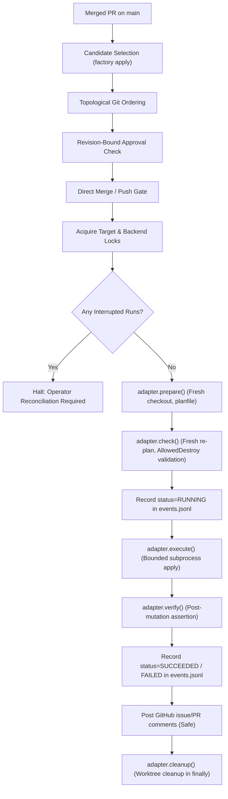

# Deployment Lifecycle & Recovery Guide

`agent-factory` provides an ordered, authorized, and fault-tolerant deployment lifecycle for infrastructure repositories (e.g. Terraform roots). It extends the core autonomous agent loop with durable persistence, revision-bound human review gates, adapter-based execution, and explicit crash recovery.

---

## Architecture & Lifecycle



---

## Configuration

In `.factory.toml`:

### Single Target (Backwards-Compatible)

```toml
[apply]
enabled = true
dir = "terraform/homelab-collectors"
baseline = 100              # Merged PRs <= 100 are ignored
supersession = "sequential" # "sequential" halts on failure; strict git commit order
```

### Multiple Targets & Shared Backends

```toml
[apply]
enabled = true
baseline = "c0ffee12"       # Commit SHA baseline: commits <= c0ffee12 are ignored
supersession = "sequential"

[[apply.targets]]
name = "collectors"
dir = "terraform/homelab-collectors"
backend_key = "shared_homelab"
adapter = "terraform"

[[apply.targets]]
name = "monitoring"
dir = "terraform/monitoring"
backend_key = "shared_homelab"
adapter = "terraform"
```

* `backend_key`: Serializes deployment across multiple targets that share a common state backend (e.g. shared S3 state lock or Consul cluster), preventing overlapping apply passes.
* `adapter`: Pluggable deployment adapter (`"terraform"`, `"fake"`, etc.).
* `supersession`: `"sequential"` enforces that tickets apply strictly in git topological commit order. A failure halts the target until resolved; subsequent commits are never applied out of order.

---

## DeployRun Contract & Persistence

All deployments are recorded durably to `.factory/events.jsonl` using a versioned contract (`CONTRACT_VERSION = 1`):

```json
{
  "at": "2026-09-14T01:00:00Z",
  "event": "deploy_run",
  "run_id": "deploy-collectors-c1a2b3c4-1",
  "target": "collectors",
  "commit": "c1a2b3c45678...",
  "ticket": 42,
  "attempt": 1,
  "status": "succeeded",
  "started_at": "2026-09-14T01:00:00Z",
  "completed_at": "2026-09-14T01:01:23Z",
  "duration_sec": 83.2,
  "pr": 10,
  "output": "Apply complete! Resources: 1 added, 0 changed, 0 destroyed.",
  "error": null,
  "version": 1
}
```

### Legacy Migration

Legacy events (`applied` with `ok=true`/`ok=false`, `apply-escalate`) are parsed and projected cleanly:
* `applied` with `ok=false` and `apply-escalate` are strictly projected as `FAILED`.
* Failed legacy tickets are treated as terminal failures and **never silently auto-retried**.

---

## Safety Guarantees

1. **Revision-Bound Human Approval:** Merged PRs require human review approval (`reviewDecision == "APPROVED"`). If review approval was on commit $A$ but an unapproved commit $B$ was merged, the deployment is rejected and escalated.
2. **Unauthorized Direct Merge Refusal:** Any commit directly pushed or merged to `main` touching a target directory without an approved PR is flagged. `agent-factory` records a `deploy_unauthorized` audit event and halts execution for that target.
3. **Topological Git Ordering:** Deployments are executed strictly in topological git commit order along `main`.
4. **Idempotency & Notification Failure Isolation:** Durable disk recording (`deploy_run` with terminal status) occurs **before** GitHub notification posting. If GitHub API is down or fails, the deployment is never duplicate-executed on subsequent passes.

---

## DeployAdapter Architecture

All platform mutations implement the `DeployAdapter` lifecycle:

1. `prepare(ctx)`: Sets up isolated worktree at merge commit and initializes planfile paths.
2. `check(ctx)`: Runs fresh re-plan (`tf_plan_check.run_plan`), parses plan JSON, and validates destructive changes against `AllowedDestroy:` lines in the ticket body.
3. `execute(ctx, dry_run)`: Bounded subprocess execution with timeout. The Terraform adapter runs `terraform apply -no-color` in its own session with output in a kept log file (not a pipe), so an abrupt Factory exit does not abort the apply. On timeout it sends SIGINT so Terraform can stop gracefully and release its state lock, and SIGKILLs only after a grace period. Dry-run plans actions without mutating live state.
4. `verify(ctx)`: Post-mutation health checks or state verification.
5. `reconcile(target, interrupted_run)`: Recovery hook for interrupted runs.
6. `cleanup(ctx)`: Guaranteed cleanup of worktrees in `finally`.

Pluggability is demonstrated by `FakeDeployAdapter`, allowing test suites and new execution engines (e.g. Nomad, Kubernetes) to be plugged in via `deploy.register_adapter()`.

---

## Operational Limitations & Recovery Procedures

### 1. Interrupted / Crashed Apply

**Symptom:**
A worker process was killed (`SIGKILL`), crashed, or the host rebooted during `terraform apply`.
On the next pass, `factory apply` logs:
```
[apply] target `collectors`: interrupted run detected (deploy-collectors-c1a2b3c4-1); reconciliation required
[apply] target `collectors`: stopped (reconciliation required: interrupted terraform run deploy-collectors-c1a2b3c4-1 requires operator reconciliation)
```

`terraform apply` runs in its own session and writes to a log file rather than
a pipe, so when only the Factory process dies, Terraform normally keeps running
and finishes the apply, releasing its state lock. Its full output is in
`.factory/logs/terraform-apply-<target>-<ticket>-<UTC timestamp>.log` (mode 0600).
A host reboot, OOM kill of Terraform itself, or stopping the systemd unit (which
signals the whole control group) can still interrupt Terraform mid-apply.

**Recovery Procedure:**
1. Make sure no Terraform for this target is still running (`pgrep -a terraform`),
   then read the run's log. A final `Apply complete!` means the apply finished;
   anything else means it was cut short.
2. Inspect the state backend: which resources are recorded, and whether a state
   lock is still held.
   ```sh
   cd terraform/homelab-collectors
   terraform state list
   ```
   If Terraform was cut short, a lock is typically left behind. On backends such
   as Consul, a lock without a session never expires, and the next apply fails
   with `Error acquiring the state lock`. Only after confirming that no Terraform
   process is running, release it using the lock ID from that error or from the
   backend's lock info:
   ```sh
   terraform force-unlock <LOCK_ID>
   ```
   The same applies if Factory died during the fresh `terraform plan` of the check
   phase. In that case no deploy run is recorded; only the plan lock is left.
3. Reconcile the run via the `factory apply` CLI:
   - If the changes are healthy and reflected in state:
     ```sh
     factory apply --target collectors --reconcile-run deploy-collectors-c1a2b3c4-1 --reconcile-status succeeded --reconcile-note "operator verified state clean"
     ```
   - If the changes failed or state was rolled back:
     ```sh
     factory apply --target collectors --reconcile-run deploy-collectors-c1a2b3c4-1 --reconcile-status failed --reconcile-note "operator rolled back partial state"
     ```
   Reconcile `succeeded` only when the log shows the apply completed and the state
   matches the merged change. If the change is only partly in state, reconcile
   `failed`, acknowledge it, and repair with a new reviewed PR (for example, one
   removing configuration that never reached state).
4. Re-run `factory apply` to resume normal operation.

### 2. Sequential Failure Halting

**Symptom:**
Ticket `#11` failed during apply. Subsequent commits touching the target are blocked:
```
[apply] target `collectors`: stopping further applies after failure of #11
```

**Recovery Procedure:**
1. Check the failure summary on issue `#11` or PR.
2. Acknowledge the failure to authorize repair deployment (or reconcile with status `acknowledged`):
   ```sh
   factory apply --target collectors --acknowledge-failure 11
   ```
   Or if reconciling an interrupted run that should not block repair PRs:
   ```sh
   factory apply --target collectors --reconcile-run deploy-collectors-c1a2b3c4-1 --reconcile-status acknowledged --reconcile-note "operator acknowledged failure, authorizing repair"
   ```
3. Open a fix PR addressing the issue and merge it via the normal human review workflow.
4. The fix PR will be deployed following topological commit order.

### 3. Unauthorized Direct Merge Detected

**Symptom:**
A direct commit was pushed to `main` bypassing PR review:
```
[apply] unauthorized direct merge detected for target `collectors`: commit abc12345 touches terraform/homelab-collectors without an approved PR
```

**Recovery Procedure:**
1. Review the unapproved commit `abc12345`.
2. If the commit was intentional, record an adoption baseline to acknowledge it:
   ```toml
   [apply]
   baseline = "abc12345"
   ```
3. Or revert the unapproved commit on `main`.
