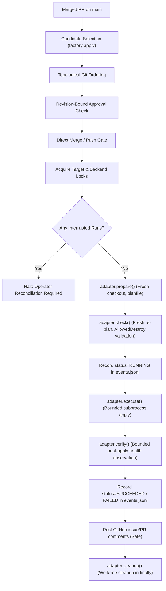

# Deployment Lifecycle & Recovery Guide

`agent-factory` provides an ordered, authorized, and fault-tolerant deployment lifecycle for infrastructure repositories (e.g. Terraform roots). It extends the core autonomous agent loop with durable persistence, revision-bound human review gates, adapter-based execution, and explicit crash recovery.

---

## Architecture & Lifecycle


```mermaid
flowchart TD
    PR["Merged PR on main"] --> Selection["Candidate Selection (factory apply)"]
    Selection --> OrderCheck["Topological Git Ordering"]
    OrderCheck --> AuthCheck["Revision-Bound Approval Check"]
    AuthCheck --> DirectMergeCheck["Direct Merge / Push Gate"]
    DirectMergeCheck --> TargetLock["Acquire Target & Backend Locks"]
    TargetLock --> InterruptedCheck{"Any Interrupted Runs?"}
    InterruptedCheck -- "Yes" --> Halt["Halt: Operator Reconciliation Required"]
    InterruptedCheck -- "No" --> Prepare["adapter.prepare() (Fresh checkout, planfile)"]
    Prepare --> Check["adapter.check() (Fresh re-plan, AllowedDestroy validation)"]
    Check --> RecordRunning["Record status=RUNNING in events.jsonl"]
    RecordRunning --> Execute["adapter.execute() (Bounded subprocess apply)"]
    Execute --> Verify["adapter.verify() (Bounded post-apply health observation)"]
    Verify --> RecordTerminal["Record status=SUCCEEDED / FAILED in events.jsonl"]
    RecordTerminal --> Notify["Post GitHub issue/PR comments (Safe)"]
    Notify --> Cleanup["adapter.cleanup() (Worktree cleanup in finally)"]
```

---

## Configuration

In `.factory.toml`:

### Single Target (Backwards-Compatible)

```toml
[apply]
enabled = true
dir = "terraform/homelab-collectors"
baseline = 100              # Merged PRs <= 100 are ignored
supersession = "sequential" # "sequential" halts on failure; strict git commit order
```

### Multiple Targets & Shared Backends

```toml
[apply]
enabled = true
baseline = "c0ffee12"       # Commit SHA baseline: commits <= c0ffee12 are ignored
supersession = "sequential"

[[apply.targets]]
name = "collectors"
dir = "terraform/homelab-collectors"
backend_key = "shared_homelab"
adapter = "terraform"

[[apply.targets]]
name = "monitoring"
dir = "terraform/monitoring"
backend_key = "shared_homelab"
adapter = "terraform"
```

* `backend_key`: Serializes deployment across multiple targets that share a common state backend (e.g. shared S3 state lock or Consul cluster), preventing overlapping apply passes.
* `adapter`: Pluggable deployment adapter (`"terraform"`, `"fake"`, etc.). An enabled target naming an adapter that is not registered stops the whole `factory apply` pass before any lock, fetch or deployment; it never falls back to Terraform.
* `supersession`: `"sequential"` enforces that tickets apply strictly in git topological commit order. A failure halts the target until resolved; subsequent commits are never applied out of order.

---

## DeployRun Contract & Persistence

All deployments are recorded durably to `.factory/events.jsonl` using a versioned contract (`CONTRACT_VERSION = 1`):

```json
{
  "at": "2026-09-14T01:00:00Z",
  "event": "deploy_run",
  "run_id": "deploy-collectors-c1a2b3c4-1",
  "target": "collectors",
  "commit": "c1a2b3c45678...",
  "ticket": 42,
  "attempt": 1,
  "status": "succeeded",
  "started_at": "2026-09-14T01:00:00Z",
  "completed_at": "2026-09-14T01:01:23Z",
  "duration_sec": 83.2,
  "pr": 10,
  "output": "Apply complete! Resources: 1 added, 0 changed, 0 destroyed.",
  "error": null,
  "version": 1
}
```

When the journal rotates (`[journal] max_mb` / `retention`), deploy rows move into `events.jsonl.N.gz` segments but are never dropped. Target-state replay (`factory apply`) and `factory inspect` read the segments as well as the live file, so failed-run blocks and acknowledgments survive rotation.

### Legacy Migration

Legacy events (`applied` with `ok=true`/`ok=false`, `apply-escalate`) are parsed and projected cleanly:
* `applied` with `ok=false` and `apply-escalate` are strictly projected as `FAILED`.
* Failed legacy tickets are treated as terminal failures and **never silently auto-retried**.

---

## Safety Guarantees

1. **Revision-Bound Human Approval:** Merged PRs require human review approval (`reviewDecision == "APPROVED"`). If review approval was on commit $A$ but an unapproved commit $B$ was merged, the deployment is rejected and escalated.
2. **Unauthorized Direct Merge Refusal:** Any commit directly pushed or merged to `main` touching a target directory without an approved PR is flagged. `agent-factory` records a `deploy_unauthorized` audit event and halts execution for that target.
3. **Topological Git Ordering:** Deployments are executed strictly in topological git commit order along `main`.
4. **Idempotency & Notification Failure Isolation:** Durable disk recording (`deploy_run` with terminal status) occurs **before** GitHub notification posting. If GitHub API is down or fails, the deployment is never duplicate-executed on subsequent passes.

---

## DeployAdapter Architecture

All platform mutations implement the `DeployAdapter` lifecycle:

1. `prepare(ctx)`: Sets up isolated worktree at merge commit and initializes planfile paths.
2. `check(ctx)`: Runs fresh re-plan (`tf_plan_check.run_plan`), parses plan JSON, and validates destructive changes against `AllowedDestroy:` lines in the ticket body.
3. `execute(ctx, dry_run)`: Bounded subprocess execution with timeout. The Terraform adapter runs `terraform apply -no-color` in its own session with output in a kept log file (not a pipe), so an abrupt Factory exit does not abort the apply. On timeout it sends SIGINT so Terraform can stop gracefully and release its state lock, and SIGKILLs only after a grace period. Dry-run plans actions without mutating live state.
4. `verify(ctx)`: Post-apply health verification under the target's `verify` policy (see below). A failed verification, or a verifier that raises, records the run `FAILED`.
5. `reconcile(target, interrupted_run)`: Recovery hook for interrupted runs.
6. `cleanup(ctx)`: Guaranteed cleanup of worktrees in `finally`.

Pluggability is demonstrated by `FakeDeployAdapter`, allowing test suites and new execution engines (e.g. Nomad, Kubernetes) to be plugged in via `deploy.register_adapter()`.

---

## Post-apply Health Verification

A successful `terraform apply` proves the API accepted the change, not that the workload
is healthy. A target's `verify` table makes Factory observe what the change touched for a
bounded window after execute. Anything not observed healthy in that window (unhealthy,
unreachable, still converging) fails verification: the run is recorded `FAILED`, escalated
and blocks the target like any failed apply, so an operator decides whether to acknowledge
it. Without a `verify` table nothing is observed and behavior is unchanged.

```toml
[apply.targets.collectors.verify]
nomad = true                          # observe the nomad_job resources the applied plan changed
nomad_addr = "nomad.service.consul:4646"  # else NOMAD_ADDR from the apply env; NOMAD_TOKEN is sent if set
timeout = 300                         # seconds for the whole window (default 300)
interval = 5                          # seconds between polls (default 5)
periodic = "registered"               # or "launch"

[[apply.targets.collectors.verify.check]]
name = "results-api"                  # argv run in the target dir with the apply env; retried until exit 0
run = ["curl", "-fsS", "http://results.service.consul/health"]
timeout = 10                          # per attempt (default: the rest of the window)
```

For the implicit single target, use `[apply.verify]`.

Nomad jobs are taken from the plan JSON that `check()` approved: every managed
`nomad_job` it created, updated, replaced or deleted. The policy depends on the live job:

| Job | Healthy when |
| --- | --- |
| service / system | The latest deployment for the current job version is `successful`. Without one, enough allocations of the current version are running (the summed group counts for a service job, at least one for a system job). A `failed` or `cancelled` deployment fails at once. |
| periodic (`periodic = "registered"`) | Registered, not stopped, periodic launches enabled. |
| periodic (`periodic = "launch"`) | As above, then Factory forces one launch and the launched child job completes with every allocation `complete`. |
| other batch, parameterized | Registered and not stopped. |
| deleted by the plan | Gone (404) or stopped. |

Evidence is a structured object (`verdict`, `elapsed_sec`, `timeout_sec`, and one item
per job or check with its policy, state, detail, poll count and observed values). It is
sanitized like the rest of the run and recorded on the terminal `deploy_run` row as
`verification`, in `summary.json`, and summarized in the issue and PR comments. Verdicts:
`healthy`, `unhealthy`, or `nothing_to_observe` (the policy is on but the plan changed no
Nomad job and no check is configured), which passes.

Limitations:

- A job ID the plan does not know (an unresolved `name`) cannot be observed and fails.
- `periodic = "launch"` really runs each changed periodic job once, with its side effects;
  with many changed jobs they all launch together. A job whose `prohibit_overlap` skips the
  forced launch times out. Use it where an extra run is harmless.
- `registered` proves the next scheduled launch will be attempted, not that it will
  succeed.
- The run stays `RUNNING` while it is observed. A Factory crash during the window leaves
  an interrupted run that needs reconciliation, as with a crash during execute.
- Health is checked once, after apply. Ongoing monitoring is out of scope.

---

## Durable Sanitized Artifacts

Every executed run (succeeded or failed) publishes artifacts to
`.factory/artifacts/<target>/<run_id>/`, outside the deploy worktree, so adapter
cleanup never removes them:

* `apply.log`: the adapter's log, streamed line by line through the sanitizer
  (capped at 20 MiB, mode 0600).
* `summary.json`: structured run summary (status, ticket, **explicit `pr`**, commit,
  attempt, timings, sanitized error and output tail, and health `verification` evidence).
* `manifest.json`: file names, sizes and sha256 of the above, plus per-sink publication
  state (`issue`, `pr`): `pending` / `ok` / `skipped` / `failed`, attempts, last error.

The sanitizer redacts every `[apply].env` value, secret-named environment values, common
token shapes (GitHub, Anthropic, Slack, AWS, 1Password, `Bearer`, `token=`) and PEM private
key blocks. The same sanitized text feeds `events.jsonl`, issue and PR comments.

**Private store.** The plan file (which can embed secrets) is copied to
`.factory/private/<run_id>/` (0700, files 0600) before cleanup. It is never listed in a
manifest, served or posted.

**Publication.** The issue comment goes to the ticket number, the PR comment to the
recorded PR number (never inferred from `agent/<ticket>`); a run with no PR number
marks the `pr` sink `skipped`. Sinks are independent: one failing leaves the other
posted and the run's terminal state untouched. `factory apply` retries `pending` sinks
at the start of each pass (up to 10 attempts, then `failed`).

**Lookup.** The dashboard serves `/api/artifacts/<target>/<run_id>/<name>` only for names
listed in the run's manifest whose on-disk sha256 still matches. `/api/file` refuses
`private/`, `artifacts/`, `apply-checkout/`, raw `terraform-apply-*` logs, plan and
state files.

Limitations:

- Runs that stop before execution (prepare/check failures) record the sanitized
  escalation reason but have no artifact directory, and their escalation comments are
  posted once without retry.
- The sanitizer redacts `[apply].env` values, secret-named environment values, common
  token shapes and PEM private-key blocks. A secret in an unrecognized format that is in
  none of those passes through.
- Plans in `private/<run_id>/` are stored raw (0700, files 0600) and follow the retention
  policy described below; unknown and unresolved runs are retained.
- Journal rows written before this contract (`applied` output, escalation reasons) were
  not sanitized and remain in `events.jsonl` and its rotated segments, which `/api/file`
  now refuses, including rotated segments and symlink aliases.

---

## Operational Limitations & Recovery Procedures

### 1. Interrupted / Crashed Apply

**Symptom:**
A worker process was killed (`SIGKILL`), crashed, or the host rebooted during `terraform apply`.
On the next pass, `factory apply` logs:
```
[apply] target `collectors`: interrupted run detected (deploy-collectors-c1a2b3c4-1); reconciliation required
[apply] target `collectors`: stopped (reconciliation required: interrupted terraform run deploy-collectors-c1a2b3c4-1 requires operator reconciliation)
```

`terraform apply` runs in its own session and writes to a log file rather than
a pipe, so when only the Factory process dies, Terraform normally keeps running
and finishes the apply, releasing its state lock. Its full output is in
`.factory/logs/terraform-apply-<target>-<ticket>-<UTC timestamp>.log` (mode 0600).
A host reboot, OOM kill of Terraform itself, or stopping the systemd unit (which
signals the whole control group) can still interrupt Terraform mid-apply.

**Recovery Procedure:**
1. Make sure no Terraform for this target is still running (`pgrep -a terraform`),
   then read the run's log. A final `Apply complete!` means the apply finished;
   anything else means it was cut short.
2. Inspect the state backend: which resources are recorded, and whether a state
   lock is still held.
   ```sh
   cd terraform/homelab-collectors
   terraform state list
   ```
   If Terraform was cut short, a lock is typically left behind. On backends such
   as Consul, a lock without a session never expires, and the next apply fails
   with `Error acquiring the state lock`. Only after confirming that no Terraform
   process is running, release it using the lock ID from that error or from the
   backend's lock info:
   ```sh
   terraform force-unlock <LOCK_ID>
   ```
   The same applies if Factory died during the fresh `terraform plan` of the check
   phase. In that case no deploy run is recorded; only the plan lock is left.
3. Reconcile the run via the `factory apply` CLI:
   - If the changes are healthy and reflected in state:
     ```sh
     factory apply --target collectors --reconcile-run deploy-collectors-c1a2b3c4-1 --reconcile-status succeeded --reconcile-note "operator verified state clean"
     ```
   - If the changes failed or state was rolled back:
     ```sh
     factory apply --target collectors --reconcile-run deploy-collectors-c1a2b3c4-1 --reconcile-status failed --reconcile-note "operator rolled back partial state"
     ```
   Reconcile `succeeded` only when the log shows the apply completed and the state
   matches the merged change. If the change is only partly in state, reconcile
   `failed`, acknowledge it, and repair with a new reviewed PR (for example, one
   removing configuration that never reached state).
4. Re-run `factory apply` to resume normal operation.

### 2. Sequential Failure Halting

**Symptom:**
Ticket `#11` failed during apply. Subsequent commits touching the target are blocked:
```
[apply] target `collectors`: stopping further applies after failure of #11
```

**Recovery Procedure:**
1. Check the failure summary on issue `#11` or PR.
2. Acknowledge the failure to authorize repair deployment (or reconcile with status `acknowledged`):
   ```sh
   factory apply --target collectors --acknowledge-failure 11
   ```
   Or if reconciling an interrupted run that should not block repair PRs:
   ```sh
   factory apply --target collectors --reconcile-run deploy-collectors-c1a2b3c4-1 --reconcile-status acknowledged --reconcile-note "operator acknowledged failure, authorizing repair"
   ```
3. Open a fix PR addressing the issue and merge it via the normal human review workflow.
4. The fix PR will be deployed following topological commit order.

### 3. Unauthorized Direct Merge Detected

**Symptom:**
A direct commit was pushed to `main` bypassing PR review:
```
[apply] unauthorized direct merge detected for target `collectors`: commit abc12345 touches terraform/homelab-collectors without an approved PR
```

**Recovery Procedure:**
1. Review the unapproved commit `abc12345`.
2. If the commit was intentional, record an adoption baseline to acknowledge it:
   ```toml
   [apply]
   baseline = "abc12345"
   ```
3. Or revert the unapproved commit on `main`.


## Deployment history in Ops

The Deployments panel projects all recorded deployment attempts independently
of the GitHub issue list, including failures attached to closed tickets. It
shows target, revision, attempt, state transitions, health evidence and
publication status. Target and status filters narrow the visible history.
The newest 200 resolved attempts are displayed alongside every unresolved
failure and unfinished attempt; counts explicitly report any truncation.

Running records distinguish execution from verification. An unfinished run
whose target lock is not held is shown as interrupted: this is an ownership
observation, not proof that every orphaned subprocess is gone. Use `factory
inspect --live` and the existing reconciliation procedure before recovery.
Acknowledged and superseded failures retain their original failed outcome.
Pending records are displayed when present; this view does not infer a pending
deployment from an arbitrary merged PR or count unrecorded candidates.

Success rate is successful attempts divided by successful plus failed attempts
in retained deployment history. Skipped, cancelled and unfinished attempts do
not enter that denominator. Mean execution duration uses only records with a
duration; it excludes health-observation time. Queue duration is PR merge to
attempt start, uses only records with a merge timestamp, and is recorded by
new apply passes. Historical records without timestamps remain unavailable.
Journal retention bounds these metrics; they are not lifetime totals.

Result and log viewers use only manifest-authorized sanitized artifacts and
verify their hashes when serving them. Historical journal output is excluded
from the deployment projection. The generic `/api/file` route refuses both
`events.jsonl` and rotated segments (also through symlink aliases), as well as
private plans/state and raw apply logs. No historical journal rewrite is needed.
The dashboard remains subject to its existing loopback/access restrictions.

Private plans remain in `.factory/private/<run_id>/` for recovery. Automated
retention keeps the latest ten terminal runs per target plus protected runs (see below).
Sanitizer coverage for unknown provider-emitted secret formats remains SHA-238.

Validation: `scripts/test-linux.sh`; browser fixture:
`node scripts/test-deployment-browser.cjs` with Playwright and its Chromium
browser installed. Set `BROWSER_CHANNEL=chrome` to use an installed Chrome.
The fixture exercises pending, executing, verifying, failed, interrupted,
superseded and successful runs, filtering, and safe artifact text display.

### System-job health limitations

System-job allocation fallback compares current-version running allocations
with the job summary's running count and rejects queued/starting placements.
It does not independently enumerate every eligible node. Placement failures on
a node may therefore go unnoticed; Nomad's cumulative Failed count cannot be
used as the expected allocation count for the current revision.

## Private plan retention

At the start of each normal apply pass, while holding apply.lock, Factory
keeps the latest ten terminal runs per target plus every unfinished run and
every failed run not explicitly acknowledged or superseded. A later successful
attempt does not by itself acknowledge an older failed run. Directories absent
from retained journal history, ambiguous ownership and symlink directories are
kept for operator inspection. No plan contents are read, posted or served.
Unreadable history aborts pruning. Failed deletions are reported and retried
on a later pass; this does not rewrite deployment outcomes.

Preview with `factory prune-private --dry-run`. This CLI is serialized with
apply passes; `--keep N` overrides the default ten for an explicit manual pass
(N must be at least one). `factory apply --dry-run` previews default retention
without deleting. Rotation is included in the authoritative replay. Retention
is not a guarantee of bounded storage while unresolved or unknown runs exist.
Backups and logs outside the private store have separate lifecycles.

## Operator recovery quick runbook

1. Pause scheduling with `systemctl --user stop <unit>.timer`. Run `factory
   inspect --json --live` using the service's absolute interpreter from the
   consumer checkout. Confirm process identity, target/apply/backend locks and
   Terraform activity before reconciliation. A free Factory lock alone does not
   prove an orphaned Terraform process is gone. Preserve private plans/logs
   needed for investigation; do not print secret-bearing state or raw logs into
   tickets. Check resource state and service health independently.
2. Preview reconciliation: `factory apply --target TARGET --reconcile-run RUN
   --reconcile-status failed --reconcile-note "operator verified stopped; repair required"
   --dry-run`. Remove `--dry-run` only after investigating the actual outcome.
   Choose succeeded only with completed apply, state and health proof; otherwise
   record failed. Do not replay a plan blindly or force-unlock a live Terraform
   process. The longer recovery procedure above covers genuine stale state locks.
3. For failed reconciliation, preview `factory apply --target TARGET
   --acknowledge-failure RUN --reconcile-note "reviewed failure; repair PR approved"
   --dry-run`, then record acknowledgment when repair is authorized. Acknowledgment
   permits future reviewed repair work; it does not claim health or erase history.
   It also makes the old private plan eligible for retention, so preserve needed
   recovery material first.
4. Inspect again, use apply dry-run to review selection, and resume the timer only
   when the intended recovery and locks are understood. A successful source/test
   result is separate from live apply/health/recovery evidence.

### Roll back a versioned Factory runtime

Pause timers, drain active dispatch/apply work, then stop the dashboard. Keep
consumer tracked changes intact. Restore the prior protected host config and
systemd unit backups from the release acceptance record, and restore the CLI
symlink to the prior versioned runtime. Run `systemctl --user daemon-reload`.
Use that runtime's absolute interpreter with `-P -m factory` for doctor,
verify-secrets (both scopes, live and nonlive), inspect and dispatch/apply dry
runs before activation. Check interpreter/gate match and credential isolation.
Run one controlled empty-queue pass, then resume dashboard/timer and inspect
again. Retain both runtimes and protected rollback assets until acceptance.
Runtime rollback does not revert infrastructure state or restore pruned private
plans; those require independently reviewed recovery and protected backups.

## Terraform PR plan-summary review contract

In apply-enabled repositories, Terraform source/lockfile changes require a
`## Terraform plan summary` PR-description section with numeric
`Plan: N to add, N to change, N to destroy` counts or `No changes` with rationale,
plus target, resource actions, validation context and `Revision: <full HEAD SHA>`.
Before PR creation the worker writes this section to the gitignored
`.factory/terraform-plan-summary-<ticket>.md`; the dispatcher copies it to the PR
and refreshes only that section after revisions. It sanitizes known credential
values before publication. The worker receives this instruction. Review fetches the PR description at the exact gated head and
rejects missing/incomplete evidence before a model can approve. The reviewer
checks the summary against the diff; the syntax gate does not prove a plan
actually ran. Software-only workflows are unaffected. Update the description
when revisions change the plan; never paste secrets or the raw plan.
