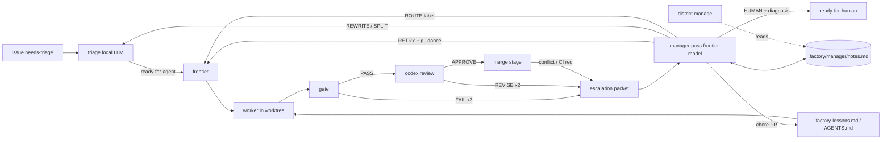

# Factory manager: research and plan

Research date: 2026-09-04. Sources: the user's GitHub stars May–Sep 2026 (19 repos read at
primary source) and 12 vendor/practitioner write-ups on hierarchical coding agents.

## 1. The proposal, restated

A persistent frontier-model agent that (a) acts where the human acts today on escalations,
(b) holds memory that outlives any one ticket, (c) optimizes workers by giving them the right
context, and (d) lays out the task graph and picks or builds the harness per job. Possibly
tiered: 1 General Manager → 3 Supervisors → 11 workers.

## 2. Where the human acts today

Every path into `escalate()` in `factory/dispatch.py` flips the ticket to `ready-for-human`,
unassigns, and comments. The trigger set is closed:

| Trigger | Site | Evidence already on disk |
|---|---|---|
| gate FAIL × `max_attempts` | `process_ticket` | gate report, attempt logs, handoff |
| wall-clock budget exceeded | `process_ticket` | attempt logs |
| branch has no commits over main | `process_ticket` | worker log |
| REVISE after `review_rounds` | `process_ticket` | PR comments with `path:line` findings |
| gate FAIL after review bounce | `process_ticket` | gate report |
| rebase onto moved main conflicts | `refresh_pr_branch` | worktree kept |
| gate FAIL after rebase | `refresh_pr_branch` | gate report |
| CI red on approved PR | `merge_pass_locked` | `gh pr checks`; label removed |
| upstream sync conflict / gate fail | `sync_escalate` | separate `ready-for-human` issue |

Plus non-`escalate()` human points: `needs-info` answers, `wontfix-proposal` confirmation,
`ready-for-human` triage decisions, dashboard inbox answers, committing `.factory-lessons.md`.

The factory skill's **Diagnose** section is already a written procedure a human follows
(events → comment → gate report → review findings → log → act at the cause). That is the
manager's job description; it is not open-ended.

## 3. What the research says

### 3.1 Consensus across sources

- **Durable state on disk, ephemeral sessions.** Anthropic's long-running-agent harness
  (`claude-progress.txt` + JSON feature list), Codex long-horizon (`Documentation.md`),
  Gas Town ("sessions are disposable; Beads persist"), firstmate (durable wake queue, tokenless
  watcher), supergoal (`STATE.md`, phase files). Nobody recommends a long-lived process as the
  source of truth. [1][2][3][4][5]
- **Workers get a bounded brief, not the big picture.** Anthropic research system, Cursor
  planner/worker split, OpenAI manager pattern, Gas Town molecules. [6][7][8][3]
- **No vector store by default.** Anthropic SDK guidance calls semantic search "less accurate,
  less transparent, harder to maintain" than agentic filesystem search; Codex, Gas Town, rowboat,
  supergoal, graphify all use Markdown/JSON/Git. [9][10][11]
- **Hierarchy only where slices are genuinely independent.** Cognition's counterargument
  (parallel workers make unshared design decisions) and Anthropic's own note that coding has
  fewer safely parallel slices than research. Cursor *removed* its integrator tier because it
  bottlenecked. [12][6][7]
- **Self-declared completion is unreliable; deterministic verification is the defense.**
  Universal. The factory's gate already is this.
- **Bound every retry loop with a counter and a durable record.** Gas Town re-escalation limit,
  supergoal's 3-strike `BLOCKED`, paperclip's hard budget pause, openworker's 5-denial pause,
  headlong's watchdog/iteration caps. [3][5][13][14][15]
- **Prune harness scaffolding as models improve.** Anthropic 2026 harness guidance. [16]

### 3.2 Mechanisms worth stealing (with the repo that has them)

| Mechanism | Source | Factory mapping |
|---|---|---|
| Structured escalation record: severity, ack, re-escalation count | Gas Town `docs/design/escalation.md` [3] | `.factory/escalations/<n>.md` + `escalate` event fields |
| Escalation packet: criterion, attempts/probes, fix spec, next move | supergoal `PROTOCOL.md` [5] | same file |
| Decide → durable decision record → act → terminal outcome | OpenBot gateway/audit [17] | `manage` event before the `gh` call |
| Closed decision menu, code applies it | openworker role-constrained transitions [14] | `DECISION:` line parsed like `VERDICT:` |
| Persistent scoped supervisor "home", idle until woken by event | firstmate secondmates [4] | manager runs per dispatch pass over `.factory/manager/` |
| Natural-language routing rules → harness/model/effort | firstmate `crew-dispatch.json` [4] | `[workers]` gains a `when` field |
| Two-stage memory: cheap append at task time, background consolidation with a verified cursor | vellum-assistant retrospective job [18] | `events.jsonl` is the buffer; `factory learn` is the consolidator (exists) |
| Gardener that promotes recurring evidence into dated key facts, marks stale | rowboat `note_curation` [11] | manager consolidates `notes.md` at end of run |
| Per-worktree untracked scratch for handoffs | helmor `.agent-contexts/` [19] | `.factory/handoff-<n>.md` (exists) |
| Deterministic, confidence-labeled code map; refuse to overwrite a fuller map with a partial one | graphify [10] | optional input to ticket briefs, later |
| Baseline/delta structural signal as a decision input, not a verdict | sentrux `gate --save` [20] | optional gate check, later |
| Pre-spawned workers spend no tokens until assigned; human approves the roster | openworker team registry [14] | routing labels are the roster; host config is the approval |

### 3.3 What to avoid

- Gas Town's full role taxonomy (Mayor/Deacon/Witness/Refinery/Dogs). Its author's own warning:
  expensive, chaotic, immature, optimized for throughput over reliability. [3]
- Paperclip/OpenBot control planes (Postgres, org trees, CEL policy). Factory already has a
  ticket pipeline; it needs a narrow resolver. [13][17]
- Understand-Anything's LLM-heavy whole-repo graph per ticket (significant init tokens). [21]
- A manager that manufactures a task graph to create parallelism (Anthropic, Cursor). [6][7]
- Conversation-as-task-graph (agent-orchestrator). Represent dependencies explicitly. [22]

## 4. Position

### 4.1 Agree

1. **A frontier agent at the escalation point is the highest-leverage, lowest-risk addition.**
   Escalations are rare (bounded by `max_attempts`, `review_rounds`, `budget_min`), the evidence is
   already structured, the procedure is already written, and the action set is closed. Cost is
   bounded by escalation rate.
2. **Memory outliving workers: yes, as files.** `.factory-lessons.md` (committed, worker-facing)
   and `events.jsonl` (buffer) already exist. Add one manager-facing notes file. No database.
3. **Worker optimization through context: yes, and the levers already exist.** A worker's harness
   is `worker binary + repo AGENTS.md + repo skills + .factory-lessons.md + prompt`. The manager
   optimizes workers by curating the committed files (via PRs that pass gate + review + human) and
   by choosing routing labels. `learn.py` already names the eval signal: first-gate pass rate.

### 4.2 Push back

1. **Fixed 1 → 3 → 11 is premature.** The hierarchy already exists in the infrastructure:
   host (District) → repo (factory) → ticket (worker). `~/.config/factory/config.toml` registers
   three repos; `max_active` per repo gives the worker count. Map the tiers onto that:
   *GM = District-level pass over the fleet; Supervisor = per-repo manager; Workers = as today.*
   Numbers fall out of config. Do not add a tier that has no independent slice to own.
2. **"Persistent agent" must mean persistent memory, not a persistent process.** Every source
   says state on disk, sessions ephemeral, wake on events. A daemon adds crash, context-bloat,
   and race modes, and fights the systemd-timer architecture. The manager runs inside the
   dispatch pass, reads its notes, acts, writes its notes, exits.
3. **"Lays out the graph": only on evidence, never proactively.** Tickets are the graph;
   `Blocked by: #N` are the edges. The manager may *split* a ticket when an escalation says it is
   too big, and manager-authored tickets go through triage like everyone else's. It does not
   re-plan the backlog.
4. **"Builds harnesses": start with routing and context curation; measure; only then build.**
   New `[workers]` entries live in host config (District-owned) and need a human to apply.
   Purpose-built agent definitions are phase 3, gated on phase 2 metrics showing routing +
   context curation is insufficient.
5. **Authority boundary is the design.** Decided 2026-09-04; see §4.3. The one invariant that
   makes the FM a safe merge authority: **the FM never writes code.** Workers write, the host
   gate verifies, codex reviews the diff, the FM reviews with history and decides — four
   independent signals, none self-approved. Conflict resolution, CI fixes and REVISE follow-ups
   are always dispatched as worker rounds.
6. **Measure before building.** Anthropic: add complexity when measured outcomes justify it.
   Ticket 1 is the baseline.

### 4.3 Authority boundary (decided)

The happy-path merge is already autonomous (`merge_pass_locked`: gate PASS + `factory-approved`
\+ green CI + head contains `main`); the human only blocks. Release branches (`release/*`) hold
stability, so `main` may absorb FM risk. Decisions taken: FM final review runs on escalated PRs
only (`manager.review = "escalated"`; `"all"` available); human-authored PRs are out of scope
for v1 (v2 extends the PR frontier to them); wontfix on human issues stays proposal-only.

| Action | FM autonomous | Rule |
|---|---|---|
| Relabel / rewrite / split / route ticket | yes | bounded by `rounds` |
| Dispatch a worker round (`ci-fix`, `conflict`, REVISE follow-up) | yes | profile chosen by `[workers].when` |
| Re-add `factory-approved` after a red-CI escalation | yes | after gate PASS + fresh codex APPROVE |
| Final merge review on a PR | escalated/flagged PRs | the "trusted authority with memory" gate |
| Merge to `main` | yes | FM adds/withholds the label; the merge stage merges |
| Close a factory PR (`agent/*`) as wontfix | yes, with diagnosis | the PR is the factory's attempt |
| Close a factory-created child issue (from SPLIT) | yes | FM created it |
| Close a human-authored issue as wontfix | **no** | `wontfix-proposal` + comment; the reporter owns intent |
| Shepherd human-authored PRs | **no (v1)** | v2: PR frontier includes them |
| Push `release/*`, cut a release, hotfix a release | **no** | the stability guarantee behind everything above |
| Edit `[[gate.check]]`, `[leak_scan]`, `.github/workflows/*` | PR only; human merges | the FM must not weaken its own verification |
| Edit `AGENTS.md` / skills / `.factory-lessons.md` | PR; FM may merge after codex APPROVE | context, not verification |
| Change `[workers]` / `[manager]` host config | recommend in diagnosis | human/District applies |
| Raise `max_active` / `budget_min` | within `[defaults.manager]` caps | hard pause at the cap |

**FM owns the PR loop; specialists are worker profiles, not a tier.** QA is already three
independent signals (host gate, codex, GitHub CI). The judgment states in the PR loop are
closed — red CI (flake vs real vs infra, which needs FM notes), non-converging REVISE, stale PR —
so a deterministic PR frontier handles the rest and calls the FM only for those. `ci-fix` and
`conflict` are `[workers]` entries with `when` rules, routed like `chore`.

**Models (decided 2026-09-04).** FM = `openai-codex/gpt-6-astra`; reviewer =
`anthropic/claude-fable-5-1`; both run through `omp -p` so a model change is one `--model`
flag. Rule: FM and reviewer stay on different model families, so the merge precondition is two
independent verdicts, not one model grading itself with more context. `codex exec` is retired
from the pipeline (it cannot run a non-OpenAI model). Workers unchanged; an astra worker profile
for hard tickets is a `[workers]` entry with a `when` rule once #20 lands.

### 4.4 Loop-safety and trust rules

- `manager_rounds` per ticket (default 1). Exhausted → `ready-for-human` with the manager's
  diagnosis attached. A `manage` event is written *before* the `gh` mutation (decide → record →
  act).
- If a human has commented or changed labels since the escalation, the manager skips the
  ticket: a human took it.
- Manager comments carry a fixed prefix (`Factory manager:`) so `build_prompt`, the dashboard
  and humans can attribute them.
- Issue bodies and comments are untrusted input. The manager's decision menu is closed and
  applied by code; the manager gets no shell in the main checkout. If it needs to read code it
  reads the kept worktree.
- One frontier call per escalation, not per pass. Idle passes cost nothing.

## 5. Architecture after the plan

## 6. Tickets

Ordered; `Blocked by` gives the edges. Each is one observable change with a checkable exit gate
(`.github/ISSUE_TEMPLATE/agent_task.md` shape). Phase 0–1 is the deliverable that replaces the
human at the escalation point; later phases are gated on its metrics.

### Phase 0 — Baseline

**T1. Human-touch metrics in `factory stats` and the dashboard**
- Scope: for each finished ticket, report escalation count, who resolved each escalation
  (human vs. factory; detectable from label-change actor on the issue timeline), minutes in
  `ready-for-human`, and re-queue count. Aggregate: escalations/week, % resolved by human.
- Touches: `factory/stats.py`, `factory/dashboard.py` (`metrics()`), `dashboard.html` KPI row.
- Exit gate: `factory stats` prints the new columns for the existing `events.jsonl`; the
  dashboard KPI row shows escalations/week and human-resolved %.
- Out of scope: any manager behavior.

### Phase 1 — Manager at the escalation point

**T2. Structured escalation packet** — Blocked by: none
- Scope: `escalate()` writes `.factory/escalations/<n>.md` (reason, attempt table from
  `events.jsonl`, last gate report tail, latest review findings, handoff text, log paths,
  worktree path) and the `escalate` event carries `packet` path and `round` (escalations so far
  for this ticket). `sync_escalate` writes the same shape for `upstream`. Deterministic; no LLM.
- Touches: `dispatch.py` `escalate`, `sync_escalate`, `record`.
- Exit gate: a forced gate failure (`--ticket N` against a ticket whose check is `false`)
  produces the packet with every section populated; `tests/test_factory.py` asserts the shape.
- Out of scope: reading the packet.

**T3. `[manager]` config table** — Blocked by: none
- Scope: `[manager] command = [...]` (argv template with `{prompt}`, `{cwd}`; default unset =
  disabled), `rounds = 1`. Host-layer table like `review` (`HOST_TABLES`). `factory doctor`
  reports the binary; `dashboard --json` `config` includes it.
- Touches: `config.py` (`KNOWN_KEYS`, `HOST_TABLES`, `Config`, loader), `onboard.py` doctor,
  `templates/factory.toml`, `dashboard.py`.
- Exit gate: `factory doctor` prints a `manager:` row when configured and nothing when not;
  unknown keys under `[manager]` are reported as drift.
- Out of scope: running it.

**T4. `factory manage` stage** — Blocked by: T2, T3
- Scope: new module `factory/manage.py`, run at the top of the dispatch pass (after
  `land_pass`, before `frontier`). For each open issue labeled `ready-for-human` that has a
  packet, no human activity since the escalation, and `round <= manager.rounds`: build a prompt
  from packet + `.factory-lessons.md` + `.factory/manager/notes.md` + the closed decision menu;
  run `manager.command` with `cwd` = the kept worktree (or `ROOT` read-only if none); parse the
  final `DECISION: RETRY|REWRITE|SPLIT|ROUTE|HUMAN` line plus a body. Apply by code:
  RETRY → comment `Factory manager: <guidance>`, relabel `ready-for-agent`;
  REWRITE → comment with the old body, `gh issue edit --body`, relabel `ready-for-agent`;
  SPLIT → create sub-issues labeled `needs-triage` with `Blocked by` lines, comment on the
  parent, leave the parent `ready-for-human` until children close;
  ROUTE → add/remove a label that exists in `[workers]`, relabel `ready-for-agent`;
  HUMAN → comment the diagnosis, stay. Unparseable output = HUMAN. Record `manage` event
  (`decision`, `round`, `packet`) before the `gh` calls.
- Touches: `manage.py` (new), `dispatch.py` `main`, `cli.py`, `config.py`.
- Exit gate: with a fake manager command (`printf 'DECISION: RETRY\n...'`), a `ready-for-human`
  ticket with a packet is relabeled `ready-for-agent` with the prefixed comment and a `manage`
  event; a second escalation of the same ticket is left alone (rounds exhausted); a ticket with a
  human comment after the escalation is skipped. All three in `tests/test_factory.py` with `gh`
  stubbed as the existing tests do.
- Out of scope: memory write-back; sync escalations; any decision outside the menu.

**T5. Manager notes: read, write-back, consolidation** — Blocked by: T4
- Scope: `.factory/manager/notes.md` (gitignored). Every manager prompt includes it. The manager
  ends its output with a fenced `notes` block that replaces the file; the code caps it at N KB
  and refuses an empty replacement of a non-empty file (graphify's "don't overwrite a fuller
  artifact"). Prompt instructs: date each note, keep only evidence-backed, recurring items
  (flaky check names, ticket-author patterns, what RETRY guidance worked), drop stale ones.
- Touches: `manage.py`, `.gitignore` via `onboard.py` `GITIGNORE_LINES`.
- Exit gate: two consecutive fake-manager runs show the second prompt containing the first
  run's notes; an empty `notes` block does not truncate the file.
- Out of scope: lessons file; cross-repo.

**T6. PR frontier: the FM shepherds every open `agent/*` PR to a terminal state** — Blocked by: T4
- Scope: alongside the ticket frontier, list open `agent/*` PRs and map state → action:
  CI pending → wait; behind main → `refresh_pr_branch` (exists); CI red / rebase conflict /
  gate-after-rebase / REVISE not converging / stale (no activity > N days) → escalation packet
  → FM. FM decisions for PRs add `FIX` (dispatch one `worker_round` in the kept worktree with the
  guidance as `extra`, re-gate, push, re-review; re-add `factory-approved` only on a fresh
  APPROVE) and `CLOSE` (close the PR with a diagnosis; the linked issue gets `wontfix-proposal`
  unless the factory created it). `manager.review = "escalated" | "all"` selects whether the FM
  also reviews non-escalated PRs before the label is granted. Bounded by `rounds` per PR.
  Human-authored PRs are excluded (v1).
- Touches: `manage.py`, `dispatch.py` (`worker_round`, `review`, `approve_pr`, `merge_pass_locked`).
- Exit gate: a PR whose `factory-approved` label was removed by red CI is, after a fake-manager
  `FIX` and a green gate + APPROVE, relabeled `factory-approved` and merged on the next pass;
  a fake-manager `CLOSE` on a human-authored issue's PR closes the PR and labels the issue
  `wontfix-proposal` without closing it; a human-authored PR is never listed in the frontier.
- Out of scope: upstream sync issues (T12); `release/*` (never).

### Phase 2 — Context provisioning (worker optimization)

Gate: T1 shows ≥ 4 weeks of manager data and the human-resolved % dropped.

**T7. Manager-run `factory learn` opens a chore PR** — Blocked by: T5
- Scope: when `[manager]` is set, `factory learn` uses `manager.command` instead of the triage
  model, includes `notes.md` as evidence, and instead of writing the file in `ROOT` it commits
  `.factory-lessons.md` on `agent/lessons-<date>` and opens a PR labeled `chore` so gate, review
  and the human see it. Eval remains first-gate pass rate before/after (already in the doc
  string of `learn.py`).
- Touches: `learn.py`, `dispatch.py` `push_and_pr`.
- Exit gate: `factory learn` with the fake manager opens a PR containing only
  `.factory-lessons.md`; without `[manager]` the current behavior is unchanged.
- Out of scope: AGENTS.md edits.

**T8. Per-ticket brief at claim time** — Blocked by: T5
- Scope: before attempt 1, a deterministic pass produces `.factory/brief-<n>.md`: files
  matched by `git log -S`/grep of ticket nouns, the last 3 merged PRs that touched them, the
  triage `Agent brief` comment, matching lessons. Token-capped. Appended to the prompt as
  `## Brief`. No LLM in v1; the manager may later rewrite the brief on RETRY.
- Touches: `dispatch.py` `build_prompt`, new `brief.py`.
- Exit gate: a ticket naming a symbol yields a brief listing the file that defines it and the
  last PR that changed it; `factory stats` shows first-gate pass rate split by tickets with/
  without a brief.
- Out of scope: knowledge-graph tooling (graphify) — revisit if grep-based briefs plateau.

**T9. Manager proposes harness-context changes as chore PRs** — Blocked by: T7
- Scope: a new manager decision `CURATE` (only from `factory learn`, never from an escalation)
  that edits `AGENTS.md` / `.omp/skills/**` / `CONTRIBUTING.md` in the target repo on
  `agent/curate-<date>`, opens a `chore` PR with the evidence (which tickets, which notes). Human
  merges via the normal flow.
- Touches: `learn.py`, `manage.py`.
- Exit gate: fake manager emitting `CURATE` with a diff opens a PR touching only the listed
  paths; a `CURATE` from an escalation packet is rejected and recorded.
- Out of scope: gate check edits (`[[gate.check]]` stays human-only).

### Phase 3 — Routing and specialization

Gate: T8 metrics by label show a worker type losing consistently on a ticket class.

**T10. Per-label pass rates** — Blocked by: T1
- Scope: `factory stats` and the dashboard split first-gate pass rate, attempts and cost by the
  worker label that ran the ticket (`claimed` event already records labels).
- Exit gate: `factory stats --by-worker` prints one row per `[workers]` key.

**T11. Routing rules the manager can read; `ci-fix` and `conflict` profiles** — Blocked by: T4, T10
- Scope: `[workers.<label>]` may carry `when = "<natural-language description>"` (firstmate's
  `crew-dispatch.json` pattern). The manager prompt lists labels with their `when`; `ROUTE` and
  `FIX` are only accepted for listed labels. Ship two default profiles in `templates/factory.toml`:
  `ci-fix` (read the failing job log, fix or declare flake with evidence) and `conflict` (resolve
  the rebase, keep both intents, no semantic changes). New profiles are still added by a human in
  host config (District-owned); the manager may recommend one in a HUMAN diagnosis.
- Touches: `config.py` (`[workers]` becomes table-or-array), `manage.py`, `dashboard.py`,
  `templates/factory.toml`.
- Exit gate: a `ROUTE chore` decision on a repo without a `chore` worker is rejected and
  recorded; with one, the label is applied; a `FIX` on red CI runs the `ci-fix` argv.
- Out of scope: the manager writing host config.

### Phase 4 — General Manager (fleet)

Gate: ≥ 2 repos with T5 notes and T10 data.

**T12. `district manage`** — Blocked by: T5, T10, T11
- Scope: one fleet pass per hour (District's metrics timer) that runs `manager.command` with
  every repo's `notes.md` + metrics, and may: set per-repo `max_active`/`budget_min` within host
  caps declared in `[defaults.manager]`, take the upstream-sync `ready-for-human` issues through
  the same RETRY-in-worktree path, and write `~/.config/factory/manager-notes.md` (fleet-level
  patterns). All mutations are recorded in District's registry with a reason.
- Touches: District, not this repo, except for `[defaults.manager]` keys in `config.py`.
- Exit gate: `district status --json` shows the last GM decision per repo with its reason;
  a cap in `[defaults.manager]` is never exceeded in a fake-manager run.
- Out of scope: cross-repo tickets; any tier between GM and per-repo manager.

### Explicit non-goals

- No daemon; the manager is a stage in the dispatch pass.
- No vector store or memory service; `events.jsonl` + Markdown files.
- No FM code edits, `release/*` pushes, wontfix on human issues, verification-config merges,
  or self-approval.
- No proactive backlog re-planning; decomposition only from an escalation.
- No new worker binaries until T10 shows routing and context curation is insufficient.

## Sources

1. Anthropic, Effective harnesses for long-running agents — https://www.anthropic.com/engineering/effective-harnesses-for-long-running-agents
2. OpenAI, Run long horizon tasks with Codex — https://developers.openai.com/blog/run-long-horizon-tasks-with-codex
3. Gas Town — https://raw.githubusercontent.com/gastownhall/gastown/HEAD/README.md, https://raw.githubusercontent.com/gastownhall/gastown/HEAD/docs/design/escalation.md, https://steve-yegge.medium.com/welcome-to-gas-town-4f25ee16dd04
4. firstmate — https://raw.githubusercontent.com/kunchenguid/firstmate/HEAD/docs/architecture.md, https://raw.githubusercontent.com/kunchenguid/firstmate/HEAD/.agents/skills/quota-array-dispatch/SKILL.md
5. supergoal — https://raw.githubusercontent.com/robzilla1738/supergoal/HEAD/skills/supergoal/templates/PROTOCOL.md
6. Anthropic, How we built our multi-agent research system — https://www.anthropic.com/engineering/multi-agent-research-system
7. Cursor, Scaling long-running autonomous coding — https://cursor.com/blog/scaling-agents
8. OpenAI, A practical guide to building agents — https://openai.com/business/guides-and-resources/a-practical-guide-to-building-ai-agents/
9. Anthropic, Building agents with the Claude Agent SDK — https://claude.com/blog/building-agents-with-the-claude-agent-sdk
10. graphify — https://raw.githubusercontent.com/Graphify-Labs/graphify/HEAD/ARCHITECTURE.md
11. rowboat knowledge/curation — https://github.com/rowboatlabs/rowboat/tree/main/apps/x/packages/core/src/knowledge, https://raw.githubusercontent.com/rowboatlabs/rowboat/main/apps/x/packages/core/src/knowledge/note_curation.ts
12. Cognition, Don't Build Multi-Agents — https://cognition.com/blog/dont-build-multi-agents
13. paperclip V1 spec — https://raw.githubusercontent.com/paperclipai/paperclip/master/doc/SPEC-implementation.md
14. openworker teams — https://raw.githubusercontent.com/andrewyng/openworker/HEAD/coworker/teams/tools.py, https://raw.githubusercontent.com/andrewyng/openworker/HEAD/coworker/teams/store.py
15. headlong thinkers — https://raw.githubusercontent.com/laude-institute/headlong/HEAD/design/THINKERS_spec.md
16. Anthropic, Agent Harness Design — https://claude.com/blog/harnessing-claudes-intelligence
17. OpenBot gateway/audit — https://raw.githubusercontent.com/CopilotKit/OpenBot/HEAD/docs/architecture.md, https://raw.githubusercontent.com/CopilotKit/OpenBot/HEAD/server/src/computer/gateway.ts
18. vellum-assistant memory — https://raw.githubusercontent.com/vellum-ai/vellum-assistant/main/assistant/docs/architecture/memory.md, https://raw.githubusercontent.com/vellum-ai/vellum-assistant/main/assistant/src/plugins/defaults/memory/memory-retrospective-job.ts
19. helmor agent contexts — https://raw.githubusercontent.com/dohooo/helmor/main/src-tauri/src/workspace/agent_contexts.rs
20. sentrux — https://raw.githubusercontent.com/sentrux/sentrux/HEAD/docs/quality-signal-design.md
21. Understand-Anything — https://raw.githubusercontent.com/Egonex-AI/Understand-Anything/HEAD/understand-anything-plugin/skills/understand/SKILL.md
22. agent-orchestrator — https://raw.githubusercontent.com/Untrivial-ai/agent-orchestrator/HEAD/docs/architecture.md
23. Hindsight — https://hindsight.vectorize.io/developer/observations (consolidation pattern; not adopted as a store)
24. swarm-forge handoff protocol — https://raw.githubusercontent.com/unclebob/swarm-forge/main/swarmforge/handoff-protocol.md
25. Herdr socket API — https://herdr.dev/docs/socket-api/
26. Sourcegraph, Agentic Coding in 2026 — https://sourcegraph.com/blog/agentic-coding
